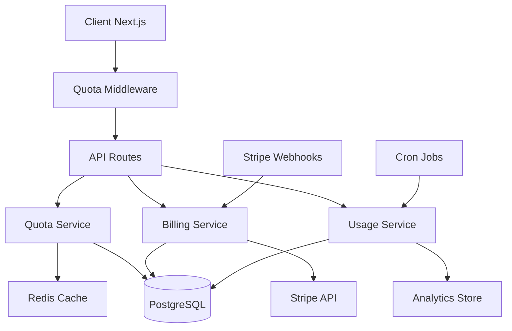

# Design Document

## Overview

Le système de gestion de comptes s'appuie sur l'architecture existante de l'application avec Prisma, Stack Auth, et Next.js. Il étend les modèles User et Plan existants pour ajouter la gestion complète des quotas, de la facturation, et des restrictions d'accès. Le système utilise une approche middleware pour les vérifications de quotas et un système d'événements pour le tracking d'utilisation en temps réel.

## Architecture

### Architecture Globale



### Flux de Données

1. **Vérification de Quotas** : Middleware → Quota Service → Cache/DB
2. **Tracking d'Utilisation** : API → Usage Service → Analytics/DB
3. **Facturation** : Billing Service ↔ Stripe API
4. **Notifications** : Event System → Notification Service

## Components and Interfaces

### 1. Extensions du Modèle de Données

#### Nouveaux Modèles Prisma

```typescript
// Ajouts au schema.prisma existant

model Subscription {
  id              String   @id @default(uuid())
  userId          String   @unique
  planId          String
  stripeCustomerId String? @unique
  stripeSubscriptionId String? @unique
  status          SubscriptionStatus
  currentPeriodStart DateTime
  currentPeriodEnd   DateTime
  cancelAtPeriodEnd  Boolean @default(false)
  createdAt       DateTime @default(now())
  updatedAt       DateTime @updatedAt
  
  user            User     @relation(fields: [userId], references: [id])
  plan            Plan     @relation(fields: [planId], references: [id])
  usageRecords    UsageRecord[]
  invoices        Invoice[]
}

model UsageRecord {
  id             String   @id @default(uuid())
  subscriptionId String
  metricType     UsageMetricType
  value          Int
  timestamp      DateTime @default(now())
  metadata       Json?
  
  subscription   Subscription @relation(fields: [subscriptionId], references: [id])
  
  @@index([subscriptionId, metricType, timestamp])
}

model Invoice {
  id             String   @id @default(uuid())
  subscriptionId String
  stripeInvoiceId String? @unique
  amount         Int      // en centimes
  currency       String   @default("eur")
  status         InvoiceStatus
  dueDate        DateTime
  paidAt         DateTime?
  createdAt      DateTime @default(now())
  
  subscription   Subscription @relation(fields: [subscriptionId], references: [id])
}

model QuotaLimit {
  id         String   @id @default(uuid())
  planId     String
  metricType UsageMetricType
  limit      Int      // -1 pour illimité
  period     QuotaPeriod
  
  plan       Plan     @relation(fields: [planId], references: [id])
  
  @@unique([planId, metricType])
}

enum SubscriptionStatus {
  ACTIVE
  CANCELED
  PAST_DUE
  UNPAID
  TRIALING
}

enum InvoiceStatus {
  DRAFT
  OPEN
  PAID
  VOID
  UNCOLLECTIBLE
}

enum UsageMetricType {
  API_CALLS
  PERSONAS_CREATED
  STORAGE_MB
  EXPORTS
  PREMIUM_FEATURES
}

enum QuotaPeriod {
  MONTHLY
  DAILY
  HOURLY
}
```

#### Extensions du Modèle User

```typescript
// Ajout de champs au modèle User existant
model User {
  // ... champs existants
  subscription    Subscription?
  accountSettings AccountSettings?
  notifications   NotificationPreference[]
}

model AccountSettings {
  id                    String   @id @default(uuid())
  userId                String   @unique
  profilePicture        String?
  timezone              String   @default("Europe/Paris")
  emailNotifications    Boolean  @default(true)
  usageAlerts           Boolean  @default(true)
  billingAlerts         Boolean  @default(true)
  createdAt             DateTime @default(now())
  updatedAt             DateTime @updatedAt
  
  user                  User     @relation(fields: [userId], references: [id])
}
```

### 2. Services Core

#### QuotaService

```typescript
interface QuotaService {
  checkQuota(userId: string, metricType: UsageMetricType, amount?: number): Promise<QuotaCheckResult>
  getCurrentUsage(userId: string, metricType: UsageMetricType): Promise<UsageStats>
  recordUsage(userId: string, metricType: UsageMetricType, amount: number, metadata?: any): Promise<void>
  getQuotaLimits(planId: string): Promise<QuotaLimit[]>
}

interface QuotaCheckResult {
  allowed: boolean
  remaining: number
  limit: number
  resetDate: Date
  reason?: string
}

interface UsageStats {
  current: number
  limit: number
  percentage: number
  resetDate: Date
}
```

#### BillingService

```typescript
interface BillingService {
  createCustomer(userId: string, email: string): Promise<string>
  createSubscription(userId: string, planId: string, paymentMethodId: string): Promise<Subscription>
  updateSubscription(subscriptionId: string, newPlanId: string): Promise<Subscription>
  cancelSubscription(subscriptionId: string, cancelAtPeriodEnd: boolean): Promise<void>
  getInvoices(userId: string): Promise<Invoice[]>
  updatePaymentMethod(customerId: string, paymentMethodId: string): Promise<void>
}
```

#### UsageService

```typescript
interface UsageService {
  trackUsage(userId: string, metricType: UsageMetricType, amount: number, metadata?: any): Promise<void>
  getUsageStats(userId: string, period: 'day' | 'month' | 'year'): Promise<UsageStats[]>
  generateUsageReport(userId: string, startDate: Date, endDate: Date): Promise<UsageReport>
  aggregateUsage(subscriptionId: string, metricType: UsageMetricType, period: QuotaPeriod): Promise<number>
}
```

### 3. Middleware et Intercepteurs

#### QuotaMiddleware

```typescript
// middleware/quota.ts
export function quotaMiddleware(metricType: UsageMetricType, amount: number = 1) {
  return async (req: NextRequest, res: NextResponse, next: NextFunction) => {
    const userId = await getCurrentUserId(req)
    if (!userId) return next()
    
    const quotaCheck = await quotaService.checkQuota(userId, metricType, amount)
    
    if (!quotaCheck.allowed) {
      return NextResponse.json(
        { 
          error: 'Quota exceeded', 
          details: quotaCheck,
          upgradeUrl: '/pricing' 
        },
        { status: 429 }
      )
    }
    
    // Enregistrer l'utilisation après succès de l'opération
    res.on('finish', () => {
      if (res.status < 400) {
        quotaService.recordUsage(userId, metricType, amount)
      }
    })
    
    return next()
  }
}
```

### 4. Composants UI

#### AccountSettingsPage

```typescript
interface AccountSettingsPageProps {
  user: User & { subscription: Subscription, accountSettings: AccountSettings }
}

// Sections principales :
// - Informations personnelles
// - Paramètres de notification
// - Sécurité et mot de passe
// - Préférences d'affichage
```

#### UsageDashboard

```typescript
interface UsageDashboardProps {
  usageStats: UsageStats[]
  quotaLimits: QuotaLimit[]
  subscription: Subscription
}

// Composants :
// - Graphiques d'utilisation par métrique
// - Barres de progression des quotas
// - Alertes de dépassement
// - Historique d'utilisation
```

#### BillingDashboard

```typescript
interface BillingDashboardProps {
  subscription: Subscription
  invoices: Invoice[]
  paymentMethods: PaymentMethod[]
}

// Composants :
// - Informations d'abonnement actuel
// - Historique de facturation
// - Gestion des moyens de paiement
// - Options de changement de plan
```

## Data Models

### Modèle de Quotas

```typescript
interface QuotaConfiguration {
  planId: string
  limits: {
    [UsageMetricType.API_CALLS]: {
      monthly: number
      daily: number
      burst: number // limite instantanée
    }
    [UsageMetricType.PERSONAS_CREATED]: {
      monthly: number
      total: number // limite cumulative
    }
    [UsageMetricType.STORAGE_MB]: {
      total: number
    }
    [UsageMetricType.EXPORTS]: {
      monthly: number
      formats: string[] // formats autorisés
    }
    [UsageMetricType.PREMIUM_FEATURES]: {
      enabled: boolean
      features: string[]
    }
  }
}
```

### Modèle d'Événements d'Utilisation

```typescript
interface UsageEvent {
  id: string
  userId: string
  subscriptionId: string
  metricType: UsageMetricType
  amount: number
  timestamp: Date
  metadata: {
    endpoint?: string
    userAgent?: string
    ipAddress?: string
    feature?: string
    [key: string]: any
  }
}
```

## Error Handling

### Types d'Erreurs Spécifiques

```typescript
class QuotaExceededError extends Error {
  constructor(
    public metricType: UsageMetricType,
    public current: number,
    public limit: number,
    public resetDate: Date
  ) {
    super(`Quota exceeded for ${metricType}`)
  }
}

class SubscriptionRequiredError extends Error {
  constructor(public feature: string) {
    super(`Subscription required for ${feature}`)
  }
}

class PaymentFailedError extends Error {
  constructor(public reason: string, public retryable: boolean) {
    super(`Payment failed: ${reason}`)
  }
}
```

### Stratégies de Récupération

1. **Quota Dépassé** : Proposer upgrade ou attendre reset
2. **Paiement Échoué** : Retry automatique + notification utilisateur
3. **Subscription Expirée** : Mode dégradé + rappels de renouvellement

## Testing Strategy

### Tests Unitaires

```typescript
// Services de base
describe('QuotaService', () => {
  test('should check quota correctly')
  test('should record usage accurately')
  test('should handle quota resets')
})

describe('BillingService', () => {
  test('should create subscriptions')
  test('should handle payment failures')
  test('should process upgrades/downgrades')
})
```

### Tests d'Intégration

```typescript
// Flux complets
describe('Account Management Flow', () => {
  test('user can upgrade plan and access new features')
  test('quota enforcement works across API endpoints')
  test('billing webhooks update subscription status')
})
```

### Tests de Performance

```typescript
// Vérification des performances
describe('Performance Tests', () => {
  test('quota checks complete under 50ms')
  test('usage tracking handles high volume')
  test('dashboard loads under 2s with full data')
})
```

## Configuration et Déploiement

### Variables d'Environnement

```bash
# Stripe
STRIPE_SECRET_KEY=sk_...
STRIPE_WEBHOOK_SECRET=whsec_...
STRIPE_PUBLISHABLE_KEY=pk_...

# Redis pour cache des quotas
REDIS_URL=redis://...

# Configuration des quotas par défaut
DEFAULT_FREE_API_CALLS=100
DEFAULT_PRO_API_CALLS=10000
DEFAULT_ENTERPRISE_API_CALLS=-1
```

### Migrations de Base de Données

```sql
-- Migration pour ajouter les nouvelles tables
-- Sera générée automatiquement par Prisma
```

### Webhooks Stripe

```typescript
// Configuration des événements Stripe à écouter
const STRIPE_EVENTS = [
  'customer.subscription.created',
  'customer.subscription.updated',
  'customer.subscription.deleted',
  'invoice.payment_succeeded',
  'invoice.payment_failed'
]
```

Cette conception s'intègre parfaitement avec votre architecture existante et utilise les meilleures pratiques pour la gestion des quotas, la facturation, et l'expérience utilisateur.