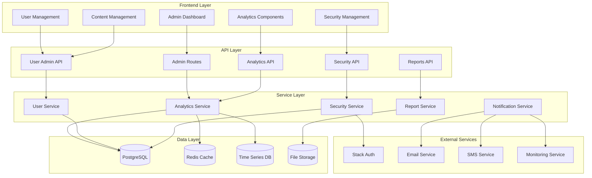

# Design Document - Système d'Administration Complet

## Overview

Le système d'administration est conçu comme une interface complète et sécurisée pour gérer tous les aspects d'une plateforme SaaS. Il s'intègre avec l'infrastructure existante utilisant Next.js, Prisma, PostgreSQL et Stack Auth, tout en ajoutant des capacités avancées d'analytics, de monitoring et de gestion.

L'architecture suit une approche modulaire avec des composants spécialisés pour chaque domaine fonctionnel, garantissant la scalabilité et la maintenabilité.

## Architecture

### Architecture Globale



### Sécurité et Authentification

Le système utilise Stack Auth existant avec des extensions pour l'administration :

- **Authentification multi-facteurs** obligatoire pour les administrateurs
- **Contrôle d'accès basé sur les rôles** (RBAC) avec permissions granulaires
- **Sessions sécurisées** avec timeout automatique
- **Audit trail** complet de toutes les actions administratives
- **Chiffrement** des données sensibles au repos et en transit

## Components and Interfaces

### 1. Admin Dashboard Core

#### AdminDashboard Component
```typescript
interface AdminDashboardProps {
  user: AdminUser;
  permissions: Permission[];
}

interface DashboardMetrics {
  totalUsers: number;
  activeUsers: number;
  revenue: {
    mrr: number;
    arr: number;
    growth: number;
  };
  systemHealth: {
    uptime: number;
    responseTime: number;
    errorRate: number;
  };
}
```

#### Navigation et Layout
```typescript
interface AdminLayoutProps {
  children: React.ReactNode;
  currentSection: AdminSection;
  user: AdminUser;
}

type AdminSection = 
  | 'dashboard'
  | 'analytics' 
  | 'users'
  | 'content'
  | 'payments'
  | 'security'
  | 'reports'
  | 'settings';
```

### 2. Analytics et Statistiques

#### Analytics Service
```typescript
interface AnalyticsService {
  getTrafficStats(period: TimePeriod): Promise<TrafficStats>;
  getConversionFunnel(funnelId: string): Promise<ConversionFunnel>;
  getUserBehavior(userId: string): Promise<UserBehavior>;
  getRevenueMetrics(period: TimePeriod): Promise<RevenueMetrics>;
}

interface TrafficStats {
  uniqueVisitors: number;
  pageViews: number;
  sessions: number;
  bounceRate: number;
  avgSessionDuration: number;
  topPages: PageStat[];
  trafficSources: TrafficSource[];
}

interface ConversionFunnel {
  steps: FunnelStep[];
  overallConversionRate: number;
  dropOffPoints: DropOffPoint[];
}
```

#### Real-time Analytics
```typescript
interface RealTimeAnalytics {
  activeUsers: number;
  currentSessions: Session[];
  liveEvents: AnalyticsEvent[];
  systemAlerts: Alert[];
}
```

### 3. Gestion des Utilisateurs

#### User Management Service
```typescript
interface UserManagementService {
  searchUsers(query: UserSearchQuery): Promise<UserSearchResult>;
  getUserDetails(userId: string): Promise<DetailedUser>;
  updateUser(userId: string, updates: UserUpdate): Promise<User>;
  suspendUser(userId: string, reason: string): Promise<void>;
  deleteUser(userId: string): Promise<void>;
  getUserActivity(userId: string): Promise<UserActivity[]>;
}

interface DetailedUser extends User {
  subscriptionHistory: Subscription[];
  paymentHistory: Payment[];
  activityLog: ActivityLog[];
  supportTickets: SupportTicket[];
  loginHistory: LoginAttempt[];
}
```

### 4. Gestion des Paiements

#### Payment Management
```typescript
interface PaymentService {
  getRevenueMetrics(period: TimePeriod): Promise<RevenueMetrics>;
  getSubscriptionStats(): Promise<SubscriptionStats>;
  getFailedPayments(): Promise<FailedPayment[]>;
  processRefund(paymentId: string, amount: number): Promise<Refund>;
  updateSubscription(subscriptionId: string, updates: SubscriptionUpdate): Promise<Subscription>;
}

interface RevenueMetrics {
  mrr: number;
  arr: number;
  churnRate: number;
  ltv: number;
  cac: number;
  revenueGrowth: number;
  subscriptionBreakdown: SubscriptionBreakdown[];
}
```

### 5. Sécurité et Audit

#### Security Service
```typescript
interface SecurityService {
  getAuditLogs(filters: AuditLogFilter): Promise<AuditLog[]>;
  getSecurityAlerts(): Promise<SecurityAlert[]>;
  blockIP(ip: string, reason: string): Promise<void>;
  getLoginAttempts(filters: LoginAttemptFilter): Promise<LoginAttempt[]>;
  generateSecurityReport(period: TimePeriod): Promise<SecurityReport>;
}

interface AuditLog {
  id: string;
  timestamp: Date;
  userId: string;
  action: string;
  resource: string;
  details: Record<string, any>;
  ipAddress: string;
  userAgent: string;
  result: 'success' | 'failure';
}
```

### 6. Notifications et Alertes

#### Notification System
```typescript
interface NotificationService {
  sendAlert(alert: Alert): Promise<void>;
  configureAlertRules(rules: AlertRule[]): Promise<void>;
  getNotificationHistory(): Promise<Notification[]>;
  updateNotificationPreferences(preferences: NotificationPreferences): Promise<void>;
}

interface Alert {
  type: AlertType;
  severity: 'low' | 'medium' | 'high' | 'critical';
  message: string;
  data: Record<string, any>;
  recipients: string[];
  channels: NotificationChannel[];
}
```

## Data Models

### Extensions au Schéma Existant

```prisma
// Nouvelles tables pour l'administration

model AdminUser {
  id                String   @id @default(uuid())
  userId            String   @unique
  mfaEnabled        Boolean  @default(false)
  mfaSecret         String?
  lastLoginAt       DateTime?
  failedLoginCount  Int      @default(0)
  lockedUntil       DateTime?
  createdAt         DateTime @default(now())
  updatedAt         DateTime @updatedAt
  
  user              User     @relation(fields: [userId], references: [id])
  auditLogs         AuditLog[]
  
  @@map("admin_users")
}

model AuditLog {
  id          String    @id @default(uuid())
  adminUserId String
  action      String
  resource    String
  resourceId  String?
  details     Json
  ipAddress   String
  userAgent   String
  result      String
  createdAt   DateTime  @default(now())
  
  adminUser   AdminUser @relation(fields: [adminUserId], references: [id])
  
  @@index([adminUserId])
  @@index([action])
  @@index([createdAt])
  @@map("audit_logs")
}

model AnalyticsEvent {
  id          String   @id @default(uuid())
  eventType   String
  userId      String?
  sessionId   String
  properties  Json
  timestamp   DateTime @default(now())
  
  @@index([eventType])
  @@index([userId])
  @@index([timestamp])
  @@map("analytics_events")
}

model SystemMetric {
  id        String   @id @default(uuid())
  name      String
  value     Float
  unit      String
  timestamp DateTime @default(now())
  tags      Json?
  
  @@index([name])
  @@index([timestamp])
  @@map("system_metrics")
}

model Alert {
  id          String    @id @default(uuid())
  type        String
  severity    String
  message     String
  data        Json
  resolved    Boolean   @default(false)
  resolvedAt  DateTime?
  createdAt   DateTime  @default(now())
  
  @@index([type])
  @@index([severity])
  @@index([resolved])
  @@map("alerts")
}

model NotificationLog {
  id          String   @id @default(uuid())
  alertId     String?
  recipient   String
  channel     String
  status      String
  sentAt      DateTime @default(now())
  
  alert       Alert?   @relation(fields: [alertId], references: [id])
  
  @@index([recipient])
  @@index([status])
  @@map("notification_logs")
}
```

### Modèles de Configuration

```typescript
interface AdminConfig {
  security: {
    mfaRequired: boolean;
    sessionTimeout: number;
    maxFailedLogins: number;
    lockoutDuration: number;
  };
  notifications: {
    emailEnabled: boolean;
    smsEnabled: boolean;
    slackWebhook?: string;
  };
  analytics: {
    retentionDays: number;
    samplingRate: number;
  };
  alerts: {
    rules: AlertRule[];
    escalationMatrix: EscalationRule[];
  };
}
```

## Error Handling

### Stratégie de Gestion d'Erreurs

1. **Erreurs de Sécurité** : Logging immédiat, notification des administrateurs, blocage automatique si nécessaire
2. **Erreurs de Données** : Validation côté client et serveur, messages d'erreur explicites
3. **Erreurs Système** : Monitoring automatique, alertes, fallback vers des données en cache
4. **Erreurs d'API** : Retry automatique, circuit breaker, dégradation gracieuse

```typescript
interface ErrorHandler {
  handleSecurityError(error: SecurityError): Promise<void>;
  handleDataError(error: DataError): Promise<ErrorResponse>;
  handleSystemError(error: SystemError): Promise<void>;
  handleAPIError(error: APIError): Promise<ErrorResponse>;
}

interface ErrorResponse {
  success: false;
  error: {
    code: string;
    message: string;
    details?: Record<string, any>;
  };
  timestamp: string;
}
```

## Testing Strategy

### Tests Unitaires
- Services d'administration avec mocks des dépendances
- Composants React avec React Testing Library
- Utilitaires de sécurité et validation
- Couverture de code minimum : 90%

### Tests d'Intégration
- API endpoints avec base de données de test
- Flux d'authentification et autorisation
- Intégrations avec services externes (mocks)

### Tests de Sécurité
- Tests de pénétration automatisés
- Validation des contrôles d'accès
- Tests d'injection SQL et XSS
- Audit des dépendances

### Tests de Performance
- Load testing des endpoints critiques
- Tests de stress sur les requêtes analytics
- Monitoring des temps de réponse
- Tests de montée en charge

### Tests End-to-End
- Parcours administrateur complets
- Scénarios de gestion d'incidents
- Tests de notification et alertes
- Validation des rapports générés

```typescript
// Exemple de test de sécurité
describe('Admin Security', () => {
  it('should require MFA for admin access', async () => {
    const response = await request(app)
      .post('/api/admin/login')
      .send({ email: 'admin@test.com', password: 'password' });
    
    expect(response.status).toBe(200);
    expect(response.body.requiresMFA).toBe(true);
  });
  
  it('should log all admin actions', async () => {
    await adminService.updateUser(userId, updates);
    
    const auditLogs = await auditService.getRecentLogs();
    expect(auditLogs[0].action).toBe('user_update');
    expect(auditLogs[0].resourceId).toBe(userId);
  });
});
```

## Performance et Scalabilité

### Optimisations Frontend
- Lazy loading des composants lourds
- Virtualisation des listes longues
- Mise en cache des données fréquemment consultées
- Compression et optimisation des assets

### Optimisations Backend
- Indexation optimisée des requêtes analytics
- Pagination et filtrage côté serveur
- Cache Redis pour les métriques fréquentes
- Agrégation des données en arrière-plan

### Monitoring et Alertes
- Métriques de performance en temps réel
- Alertes automatiques sur les seuils critiques
- Dashboards de monitoring système
- Logs structurés pour l'analyse

Cette conception fournit une base solide pour un système d'administration complet, sécurisé et évolutif, intégré harmonieusement avec l'architecture existante de la plateforme.