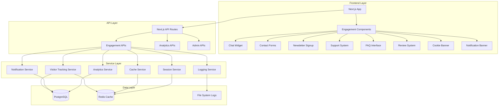

# Design Document

## Overview

The comprehensive site engagement system is designed as a modular, high-performance infrastructure that integrates seamlessly with the existing Next.js application. The system leverages modern web technologies including WebSockets for real-time communication, Redis for caching and session management, and PostgreSQL for persistent data storage. The architecture prioritizes performance, scalability, and user experience while maintaining GDPR compliance and providing actionable analytics.

## Architecture

### System Architecture



### Technology Stack Integration

- **Frontend**: React components integrated into existing Next.js pages
- **Backend**: Next.js API routes extending current API structure
- **Database**: PostgreSQL with new tables added to existing Prisma schema
- **Caching**: Redis for session management, visitor tracking, and performance optimization
- **Real-time**: WebSocket connections for chat and live notifications
- **Analytics**: Custom analytics service with dashboard integration

## Components and Interfaces

### Frontend Components

#### Chat System
```typescript
interface ChatWidget {
  isOpen: boolean;
  messages: ChatMessage[];
  onSendMessage: (message: string) => void;
  onToggle: () => void;
  userInfo?: UserInfo;
}

interface ChatMessage {
  id: string;
  content: string;
  sender: 'user' | 'agent' | 'system';
  timestamp: Date;
  status: 'sent' | 'delivered' | 'read';
}
```

#### Contact & Support System
```typescript
interface ContactForm {
  fields: FormField[];
  onSubmit: (data: ContactData) => Promise<void>;
  validation: ValidationRules;
}

interface SupportTicket {
  id: string;
  subject: string;
  description: string;
  status: 'open' | 'in-progress' | 'resolved' | 'closed';
  priority: 'low' | 'medium' | 'high' | 'urgent';
  userId?: string;
  assignedTo?: string;
  createdAt: Date;
  updatedAt: Date;
}
```

#### Visitor Tracking Interface
```typescript
interface VisitorTracker {
  trackPageView: (page: string) => void;
  trackEvent: (event: string, properties?: Record<string, any>) => void;
  trackEngagement: (type: string, duration: number) => void;
  getSuggestions: () => Promise<ActionSuggestion[]>;
}

interface ActionSuggestion {
  id: string;
  type: 'modal' | 'banner' | 'redirect' | 'highlight';
  content: string;
  trigger: TriggerCondition;
  priority: number;
}
```

### Backend Services

#### Cache Service
```typescript
interface CacheService {
  get<T>(key: string): Promise<T | null>;
  set<T>(key: string, value: T, ttl?: number): Promise<void>;
  delete(key: string): Promise<void>;
  invalidatePattern(pattern: string): Promise<void>;
  getStats(): Promise<CacheStats>;
}

interface CacheLayer {
  memory: MemoryCache;
  redis: RedisCache;
  database: DatabaseCache;
}
```

#### Session Management
```typescript
interface SessionService {
  create(userId: string, data: SessionData): Promise<Session>;
  get(sessionId: string): Promise<Session | null>;
  update(sessionId: string, data: Partial<SessionData>): Promise<void>;
  destroy(sessionId: string): Promise<void>;
  cleanup(): Promise<void>;
}

interface Session {
  id: string;
  userId?: string;
  data: SessionData;
  expiresAt: Date;
  createdAt: Date;
  lastAccessedAt: Date;
}
```

#### Analytics Service
```typescript
interface AnalyticsService {
  trackEvent(event: AnalyticsEvent): Promise<void>;
  getMetrics(timeRange: TimeRange, filters?: AnalyticsFilters): Promise<Metrics>;
  generateReport(type: ReportType, options: ReportOptions): Promise<Report>;
}

interface AnalyticsEvent {
  type: string;
  userId?: string;
  sessionId: string;
  properties: Record<string, any>;
  timestamp: Date;
}
```

## Data Models

### Database Schema Extensions

```sql
-- Engagement Tables
CREATE TABLE chat_conversations (
  id UUID PRIMARY KEY DEFAULT gen_random_uuid(),
  user_id UUID REFERENCES users(id),
  session_id VARCHAR(255),
  status VARCHAR(50) DEFAULT 'active',
  created_at TIMESTAMP DEFAULT NOW(),
  updated_at TIMESTAMP DEFAULT NOW()
);

CREATE TABLE chat_messages (
  id UUID PRIMARY KEY DEFAULT gen_random_uuid(),
  conversation_id UUID REFERENCES chat_conversations(id),
  sender_type VARCHAR(20) NOT NULL, -- 'user', 'agent', 'system'
  content TEXT NOT NULL,
  metadata JSONB,
  created_at TIMESTAMP DEFAULT NOW()
);

CREATE TABLE contact_submissions (
  id UUID PRIMARY KEY DEFAULT gen_random_uuid(),
  name VARCHAR(255) NOT NULL,
  email VARCHAR(255) NOT NULL,
  subject VARCHAR(500),
  message TEXT NOT NULL,
  status VARCHAR(50) DEFAULT 'new',
  user_id UUID REFERENCES users(id),
  created_at TIMESTAMP DEFAULT NOW(),
  processed_at TIMESTAMP
);

CREATE TABLE newsletter_subscriptions (
  id UUID PRIMARY KEY DEFAULT gen_random_uuid(),
  email VARCHAR(255) UNIQUE NOT NULL,
  status VARCHAR(50) DEFAULT 'pending',
  preferences JSONB,
  subscribed_at TIMESTAMP DEFAULT NOW(),
  unsubscribed_at TIMESTAMP,
  user_id UUID REFERENCES users(id)
);

CREATE TABLE support_tickets (
  id UUID PRIMARY KEY DEFAULT gen_random_uuid(),
  subject VARCHAR(500) NOT NULL,
  description TEXT NOT NULL,
  status VARCHAR(50) DEFAULT 'open',
  priority VARCHAR(20) DEFAULT 'medium',
  user_id UUID REFERENCES users(id),
  assigned_to UUID REFERENCES users(id),
  created_at TIMESTAMP DEFAULT NOW(),
  updated_at TIMESTAMP DEFAULT NOW()
);

CREATE TABLE reviews (
  id UUID PRIMARY KEY DEFAULT gen_random_uuid(),
  user_id UUID REFERENCES users(id),
  rating INTEGER CHECK (rating >= 1 AND rating <= 5),
  title VARCHAR(255),
  content TEXT,
  status VARCHAR(50) DEFAULT 'pending',
  created_at TIMESTAMP DEFAULT NOW(),
  approved_at TIMESTAMP
);

-- Visitor Tracking Tables
CREATE TABLE visitor_sessions (
  id UUID PRIMARY KEY DEFAULT gen_random_uuid(),
  session_id VARCHAR(255) UNIQUE NOT NULL,
  user_id UUID REFERENCES users(id),
  ip_address INET,
  user_agent TEXT,
  referrer TEXT,
  landing_page VARCHAR(500),
  created_at TIMESTAMP DEFAULT NOW(),
  last_activity TIMESTAMP DEFAULT NOW(),
  ended_at TIMESTAMP
);

CREATE TABLE visitor_events (
  id UUID PRIMARY KEY DEFAULT gen_random_uuid(),
  session_id UUID REFERENCES visitor_sessions(id),
  event_type VARCHAR(100) NOT NULL,
  page_url VARCHAR(500),
  properties JSONB,
  created_at TIMESTAMP DEFAULT NOW()
);

CREATE TABLE action_suggestions (
  id UUID PRIMARY KEY DEFAULT gen_random_uuid(),
  name VARCHAR(255) NOT NULL,
  type VARCHAR(50) NOT NULL,
  content JSONB NOT NULL,
  trigger_conditions JSONB NOT NULL,
  priority INTEGER DEFAULT 0,
  active BOOLEAN DEFAULT true,
  created_at TIMESTAMP DEFAULT NOW()
);

-- System Infrastructure Tables
CREATE TABLE system_logs (
  id UUID PRIMARY KEY DEFAULT gen_random_uuid(),
  level VARCHAR(20) NOT NULL,
  message TEXT NOT NULL,
  context JSONB,
  created_at TIMESTAMP DEFAULT NOW()
);

CREATE TABLE cache_stats (
  id UUID PRIMARY KEY DEFAULT gen_random_uuid(),
  cache_type VARCHAR(50) NOT NULL,
  hit_rate DECIMAL(5,4),
  miss_rate DECIMAL(5,4),
  total_requests BIGINT,
  recorded_at TIMESTAMP DEFAULT NOW()
);

CREATE TABLE notification_banners (
  id UUID PRIMARY KEY DEFAULT gen_random_uuid(),
  title VARCHAR(255) NOT NULL,
  content TEXT NOT NULL,
  type VARCHAR(50) DEFAULT 'info',
  active BOOLEAN DEFAULT true,
  start_date TIMESTAMP,
  end_date TIMESTAMP,
  created_at TIMESTAMP DEFAULT NOW()
);
```

### Prisma Schema Extensions

```prisma
model ChatConversation {
  id        String   @id @default(uuid())
  userId    String?
  sessionId String
  status    String   @default("active")
  createdAt DateTime @default(now())
  updatedAt DateTime @updatedAt
  
  user     User?         @relation(fields: [userId], references: [id])
  messages ChatMessage[]
  
  @@map("chat_conversations")
}

model ChatMessage {
  id             String   @id @default(uuid())
  conversationId String
  senderType     String
  content        String
  metadata       Json?
  createdAt      DateTime @default(now())
  
  conversation ChatConversation @relation(fields: [conversationId], references: [id])
  
  @@map("chat_messages")
}

model VisitorSession {
  id           String    @id @default(uuid())
  sessionId    String    @unique
  userId       String?
  ipAddress    String?
  userAgent    String?
  referrer     String?
  landingPage  String?
  createdAt    DateTime  @default(now())
  lastActivity DateTime  @default(now())
  endedAt      DateTime?
  
  user   User?           @relation(fields: [userId], references: [id])
  events VisitorEvent[]
  
  @@map("visitor_sessions")
}

model VisitorEvent {
  id         String   @id @default(uuid())
  sessionId  String
  eventType  String
  pageUrl    String?
  properties Json?
  createdAt  DateTime @default(now())
  
  session VisitorSession @relation(fields: [sessionId], references: [id])
  
  @@map("visitor_events")
}
```

## Error Handling

### Error Categories and Responses

1. **Validation Errors**: Client-side and server-side validation with user-friendly messages
2. **Rate Limiting**: Implement rate limiting for all engagement endpoints
3. **Service Unavailability**: Graceful degradation when external services are down
4. **Data Consistency**: Transaction management for critical operations
5. **Privacy Compliance**: Automatic data anonymization and deletion workflows

### Error Response Format

```typescript
interface ErrorResponse {
  error: {
    code: string;
    message: string;
    details?: Record<string, any>;
    timestamp: string;
  };
}
```

## Testing Strategy

### Unit Testing
- Component testing for all React components
- Service layer testing with mocked dependencies
- Database model testing with test database

### Integration Testing
- API endpoint testing with real database
- WebSocket connection testing
- Cache layer integration testing

### Performance Testing
- Load testing for high-traffic scenarios
- Cache performance benchmarking
- Database query optimization testing

### Security Testing
- GDPR compliance validation
- XSS and CSRF protection testing
- Rate limiting effectiveness testing

### Test Coverage Requirements
- Minimum 80% code coverage for critical paths
- 100% coverage for security-related functions
- Performance benchmarks for all caching operations

## Performance Considerations

### Caching Strategy
- **L1 Cache**: In-memory caching for frequently accessed data
- **L2 Cache**: Redis for session data and visitor tracking
- **L3 Cache**: Database query result caching
- **CDN**: Static asset caching and global distribution

### Database Optimization
- Proper indexing for all query patterns
- Connection pooling for high concurrency
- Read replicas for analytics queries
- Partitioning for large tables (visitor_events, system_logs)

### Real-time Performance
- WebSocket connection pooling
- Message queuing for high-volume chat
- Efficient event broadcasting
- Connection cleanup and management