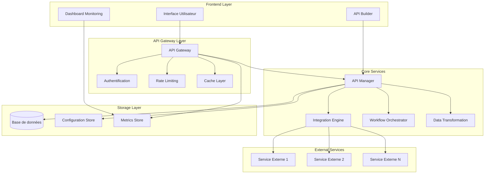

# Document de Conception - Système d'API Personnalisé et Intégrations Avancées

## Vue d'ensemble

Le système d'API personnalisé et d'intégrations avancées permettra aux utilisateurs de créer, configurer et gérer des endpoints d'API personnalisés avec des capacités d'intégration sophistiquées. Le système s'appuiera sur l'architecture Next.js existante et étendra les patterns de gestion d'API déjà en place.

### Objectifs principaux
- Fournir une interface intuitive pour créer des APIs personnalisées
- Permettre l'intégration avec des services externes multiples
- Assurer la sécurité et la performance des APIs créées
- Offrir des capacités de monitoring et d'analytics avancées
- Supporter des workflows d'intégration complexes

## Architecture

### Architecture générale



### Patterns architecturaux
- **API Gateway Pattern** : Point d'entrée unique pour toutes les requêtes
- **Plugin Architecture** : Système extensible pour les intégrations
- **Event-Driven Architecture** : Communication asynchrone entre services
- **CQRS Pattern** : Séparation des opérations de lecture/écriture pour les métriques

## Composants et Interfaces

### 1. API Builder Interface

**Composant principal** : `CustomAPIBuilder`
```typescript
interface APIEndpointConfig {
  id: string;
  name: string;
  path: string;
  method: 'GET' | 'POST' | 'PUT' | 'DELETE' | 'PATCH';
  description?: string;
  authentication: AuthConfig;
  rateLimit: RateLimitConfig;
  caching: CacheConfig;
  transformations: TransformationRule[];
  integrations: IntegrationConfig[];
  workflow?: WorkflowConfig;
  version: string;
  isActive: boolean;
  createdAt: Date;
  updatedAt: Date;
}

interface AuthConfig {
  type: 'none' | 'api-key' | 'jwt' | 'oauth2';
  settings: Record<string, any>;
  roles?: string[];
}

interface RateLimitConfig {
  enabled: boolean;
  requestsPerMinute: number;
  burstLimit: number;
  strategy: 'fixed-window' | 'sliding-window' | 'token-bucket';
}

interface CacheConfig {
  enabled: boolean;
  ttl: number;
  strategy: 'memory' | 'redis' | 'database';
  invalidationRules: string[];
}
```

### 2. Integration Engine

**Service principal** : `IntegrationService`
```typescript
interface IntegrationConfig {
  id: string;
  name: string;
  type: 'http' | 'graphql' | 'webhook' | 'database';
  endpoint: string;
  authentication: ExternalAuthConfig;
  headers: Record<string, string>;
  timeout: number;
  retryPolicy: RetryConfig;
  fallbackStrategy: FallbackConfig;
}

interface RetryConfig {
  maxAttempts: number;
  backoffStrategy: 'linear' | 'exponential' | 'fixed';
  baseDelay: number;
  maxDelay: number;
}

interface FallbackConfig {
  enabled: boolean;
  strategy: 'cache' | 'default-response' | 'alternative-service';
  fallbackData?: any;
}
```

### 3. Data Transformation Engine

**Service principal** : `TransformationService`
```typescript
interface TransformationRule {
  id: string;
  name: string;
  type: 'map' | 'filter' | 'aggregate' | 'validate' | 'custom';
  inputSchema: JSONSchema;
  outputSchema: JSONSchema;
  rules: TransformationStep[];
  testCases: TestCase[];
}

interface TransformationStep {
  operation: string;
  source: string;
  target: string;
  condition?: string;
  parameters?: Record<string, any>;
}

interface TestCase {
  name: string;
  input: any;
  expectedOutput: any;
  description?: string;
}
```

### 4. Workflow Orchestrator

**Service principal** : `WorkflowService`
```typescript
interface WorkflowConfig {
  id: string;
  name: string;
  trigger: TriggerConfig;
  steps: WorkflowStep[];
  errorHandling: ErrorHandlingConfig;
  notifications: NotificationConfig[];
}

interface WorkflowStep {
  id: string;
  name: string;
  type: 'integration' | 'transformation' | 'condition' | 'delay' | 'parallel';
  config: any;
  onSuccess?: string; // Next step ID
  onError?: string; // Error handling step ID
  timeout?: number;
}

interface TriggerConfig {
  type: 'api-call' | 'schedule' | 'webhook' | 'event';
  config: any;
}
```

### 5. Monitoring et Analytics

**Service principal** : `MonitoringService`
```typescript
interface APIMetrics {
  endpointId: string;
  timestamp: Date;
  responseTime: number;
  statusCode: number;
  requestSize: number;
  responseSize: number;
  userId?: string;
  userAgent?: string;
  ipAddress?: string;
  errorMessage?: string;
}

interface PerformanceAlert {
  id: string;
  endpointId: string;
  type: 'high-latency' | 'error-rate' | 'rate-limit' | 'downtime';
  threshold: number;
  currentValue: number;
  severity: 'low' | 'medium' | 'high' | 'critical';
  createdAt: Date;
  resolvedAt?: Date;
}
```

## Modèles de Données

### Extension du schéma Prisma

```prisma
model CustomAPI {
  id              String   @id @default(uuid())
  userId          String
  name            String
  path            String   @unique
  method          String
  description     String?
  config          Json     // APIEndpointConfig
  version         String   @default("1.0.0")
  isActive        Boolean  @default(true)
  createdAt       DateTime @default(now())
  updatedAt       DateTime @updatedAt
  
  user            User     @relation(fields: [userId], references: [id])
  metrics         APIMetric[]
  integrations    APIIntegration[]
  workflows       APIWorkflow[]
  
  @@index([userId, isActive])
  @@index([path, method])
}

model APIIntegration {
  id              String   @id @default(uuid())
  customAPIId     String
  name            String
  type            String
  config          Json     // IntegrationConfig
  isActive        Boolean  @default(true)
  createdAt       DateTime @default(now())
  updatedAt       DateTime @updatedAt
  
  customAPI       CustomAPI @relation(fields: [customAPIId], references: [id])
  
  @@index([customAPIId, isActive])
}

model APIWorkflow {
  id              String   @id @default(uuid())
  customAPIId     String
  name            String
  config          Json     // WorkflowConfig
  isActive        Boolean  @default(true)
  createdAt       DateTime @default(now())
  updatedAt       DateTime @updatedAt
  
  customAPI       CustomAPI @relation(fields: [customAPIId], references: [id])
  executions      WorkflowExecution[]
  
  @@index([customAPIId, isActive])
}

model WorkflowExecution {
  id              String   @id @default(uuid())
  workflowId      String
  status          String   // 'running' | 'completed' | 'failed' | 'cancelled'
  startedAt       DateTime @default(now())
  completedAt     DateTime?
  executionData   Json
  errorMessage    String?
  
  workflow        APIWorkflow @relation(fields: [workflowId], references: [id])
  
  @@index([workflowId, status])
  @@index([startedAt])
}

model APIMetric {
  id              String   @id @default(uuid())
  customAPIId     String
  timestamp       DateTime @default(now())
  responseTime    Int
  statusCode      Int
  requestSize     Int?
  responseSize    Int?
  userId          String?
  userAgent       String?
  ipAddress       String?
  errorMessage    String?
  
  customAPI       CustomAPI @relation(fields: [customAPIId], references: [id])
  
  @@index([customAPIId, timestamp])
  @@index([statusCode])
}

model APIAlert {
  id              String   @id @default(uuid())
  customAPIId     String
  type            String
  threshold       Float
  currentValue    Float
  severity        String
  message         String
  isResolved      Boolean  @default(false)
  createdAt       DateTime @default(now())
  resolvedAt      DateTime?
  
  @@index([customAPIId, isResolved])
  @@index([severity, createdAt])
}
```

## Gestion des Erreurs

### Stratégie de gestion d'erreurs

1. **Erreurs de validation** : Validation des configurations avant déploiement
2. **Erreurs d'intégration** : Gestion des timeouts et erreurs de services externes
3. **Erreurs de transformation** : Validation des données et rollback automatique
4. **Erreurs de workflow** : Points de reprise et compensation

### Types d'erreurs standardisés

```typescript
enum APIErrorType {
  VALIDATION_ERROR = 'VALIDATION_ERROR',
  AUTHENTICATION_ERROR = 'AUTHENTICATION_ERROR',
  AUTHORIZATION_ERROR = 'AUTHORIZATION_ERROR',
  RATE_LIMIT_ERROR = 'RATE_LIMIT_ERROR',
  INTEGRATION_ERROR = 'INTEGRATION_ERROR',
  TRANSFORMATION_ERROR = 'TRANSFORMATION_ERROR',
  WORKFLOW_ERROR = 'WORKFLOW_ERROR',
  SYSTEM_ERROR = 'SYSTEM_ERROR'
}

interface APIError {
  type: APIErrorType;
  code: string;
  message: string;
  details?: any;
  timestamp: Date;
  requestId: string;
  userId?: string;
}
```

### Circuit Breaker Pattern

```typescript
class CircuitBreaker {
  private failureCount = 0;
  private lastFailureTime?: Date;
  private state: 'CLOSED' | 'OPEN' | 'HALF_OPEN' = 'CLOSED';
  
  constructor(
    private failureThreshold: number,
    private recoveryTimeout: number
  ) {}
  
  async execute<T>(operation: () => Promise<T>): Promise<T> {
    if (this.state === 'OPEN') {
      if (this.shouldAttemptReset()) {
        this.state = 'HALF_OPEN';
      } else {
        throw new Error('Circuit breaker is OPEN');
      }
    }
    
    try {
      const result = await operation();
      this.onSuccess();
      return result;
    } catch (error) {
      this.onFailure();
      throw error;
    }
  }
}
```

## Stratégie de Test

### Tests unitaires
- Tests des services de transformation de données
- Tests des règles de validation
- Tests des intégrations avec mocks

### Tests d'intégration
- Tests des workflows complets
- Tests des APIs personnalisées créées
- Tests de performance et de charge

### Tests de sécurité
- Tests d'authentification et d'autorisation
- Tests de validation des entrées
- Tests de rate limiting

### Framework de test

```typescript
describe('CustomAPI Integration Tests', () => {
  beforeEach(async () => {
    await setupTestDatabase();
    await seedTestData();
  });
  
  it('should create and execute custom API endpoint', async () => {
    const apiConfig = createTestAPIConfig();
    const api = await apiManager.createAPI(apiConfig);
    
    const response = await request(app)
      .get(`/api/custom/${api.path}`)
      .set('Authorization', 'Bearer test-token')
      .expect(200);
      
    expect(response.body).toMatchSchema(apiConfig.outputSchema);
  });
  
  it('should handle integration failures gracefully', async () => {
    const apiConfig = createTestAPIConfigWithFailingIntegration();
    const api = await apiManager.createAPI(apiConfig);
    
    const response = await request(app)
      .get(`/api/custom/${api.path}`)
      .set('Authorization', 'Bearer test-token')
      .expect(200);
      
    expect(response.body).toEqual(apiConfig.fallbackResponse);
  });
});
```

## Sécurité

### Authentification et autorisation
- Support multi-méthodes : API Keys, JWT, OAuth2
- Gestion granulaire des permissions par endpoint
- Intégration avec le système de rôles existant

### Validation et sanitisation
- Validation stricte des configurations d'API
- Sanitisation des données d'entrée et de sortie
- Protection contre les injections et attaques XSS

### Audit et logging
- Logging complet de toutes les opérations
- Audit trail des modifications de configuration
- Monitoring des tentatives d'accès non autorisées

## Performance et Scalabilité

### Stratégies de cache
- Cache multi-niveaux (mémoire, Redis, base de données)
- Invalidation intelligente basée sur les dépendances
- Cache distribué pour la scalabilité horizontale

### Optimisations
- Connection pooling pour les intégrations externes
- Batch processing pour les transformations de données
- Lazy loading des configurations d'API

### Monitoring des performances
- Métriques en temps réel (latence, throughput, erreurs)
- Alertes automatiques sur les seuils de performance
- Profiling automatique des opérations coûteuses

```typescript
class PerformanceOptimizer {
  private connectionPools = new Map<string, ConnectionPool>();
  private batchProcessor = new BatchProcessor();
  
  async optimizeIntegrationCall(
    integration: IntegrationConfig,
    data: any[]
  ): Promise<any[]> {
    // Use connection pooling
    const pool = this.getOrCreatePool(integration);
    
    // Batch multiple requests if possible
    if (data.length > 1 && integration.supportsBatching) {
      return this.batchProcessor.process(integration, data);
    }
    
    // Single request optimization
    return this.executeSingleRequest(pool, integration, data[0]);
  }
}
```