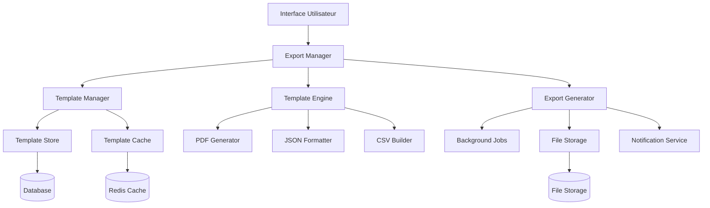

# Document de Conception - Système d'Exportation Amélioré

## Vue d'ensemble

Ce document présente la conception technique pour l'amélioration du système d'exportation existant en ajoutant des templates premium et gratuits prédéfinis, des options de design personnalisé, des thèmes alignés sur l'identité visuelle du site, et une interface utilisateur intuitive avec wizard pour les exports PDF, JSON et CSV. Le système inclut également la gestion des gros volumes avec traitement en arrière-plan et notifications.

## Architecture

### Architecture Générale



### Composants Principaux

1. **Export Manager** - Orchestrateur principal des exportations
2. **Template Manager** - Gestionnaire des templates premium/gratuits
3. **Template Engine** - Moteur de rendu des templates
4. **Export Generator** - Générateur de fichiers optimisé
5. **Theme System** - Système de thèmes et personnalisation

## Composants et Interfaces

### 1. Template Manager

```typescript
interface TemplateManager {
  // Gestion des templates
  getAvailableTemplates(userTier: 'free' | 'premium'): Template[]
  getTemplate(id: string): Template | null
  createCustomTemplate(config: TemplateConfig): Template
  saveTemplate(template: Template): void
  deleteTemplate(id: string): void
  
  // Prévisualisation
  generatePreview(templateId: string, sampleData: any): PreviewData
  validateTemplate(template: Template): ValidationResult
}

interface Template {
  id: string
  name: string
  description: string
  category: 'free' | 'premium'
  type: 'pdf' | 'json' | 'csv'
  version: string
  
  // Configuration du template
  config: TemplateConfig
  
  // Métadonnées
  author: string
  createdAt: Date
  updatedAt: Date
  downloads: number
  rating: number
  
  // Prévisualisation
  thumbnail: string
  previewImages: string[]
}

interface TemplateConfig {
  // Configuration générale
  format: 'pdf' | 'json' | 'csv'
  orientation?: 'portrait' | 'landscape' // PDF uniquement
  
  // Styling
  theme: ThemeConfig
  layout: LayoutConfig
  
  // Contenu
  sections: SectionConfig[]
  fields: FieldMapping[]
  
  // Options avancées (premium)
  customCSS?: string
  customJS?: string
  watermark?: WatermarkConfig
  branding?: BrandingConfig
}
```

### 2. Theme System

```typescript
interface ThemeManager {
  getAvailableThemes(): Theme[]
  getTheme(id: string): Theme | null
  createCustomTheme(config: ThemeConfig): Theme
  applyTheme(templateId: string, themeId: string): void
}

interface Theme {
  id: string
  name: string
  description: string
  category: 'site-aligned' | 'custom' | 'premium'
  
  config: ThemeConfig
  
  // Prévisualisation
  thumbnail: string
  colorPalette: string[]
}

interface ThemeConfig {
  // Couleurs principales
  primary: string
  secondary: string
  accent: string
  background: string
  text: string
  
  // Typographie
  fonts: {
    heading: FontConfig
    body: FontConfig
    caption: FontConfig
  }
  
  // Espacement et layout
  spacing: SpacingConfig
  borders: BorderConfig
  shadows: ShadowConfig
  
  // Éléments spécifiques
  logo?: LogoConfig
  header?: HeaderConfig
  footer?: FooterConfig
}

interface FontConfig {
  family: string
  size: string
  weight: number
  lineHeight: number
  letterSpacing?: number
}
```

### 3. Export Generator Amélioré

```typescript
interface EnhancedExportGenerator {
  // Exportation avec templates
  exportWithTemplate(
    data: any[], 
    templateId: string, 
    options: ExportOptions
  ): Promise<ExportResult>
  
  // Exportation en arrière-plan
  exportAsync(
    data: any[], 
    config: ExportConfig
  ): Promise<ExportJob>
  
  // Gestion des gros volumes
  exportLargeDataset(
    data: any[], 
    config: ExportConfig,
    onProgress: (progress: number) => void
  ): Promise<ExportResult>
  
  // Prévisualisation
  generatePreview(
    data: any[], 
    templateId: string
  ): Promise<PreviewData>
}

interface ExportOptions {
  // Options de base étendues
  format: 'pdf' | 'json' | 'csv'
  templateId: string
  themeId?: string
  
  // Options de contenu
  includeMetadata: boolean
  includeAnalytics: boolean
  includeCharts: boolean
  
  // Options de personnalisation
  customBranding?: BrandingConfig
  customWatermark?: WatermarkConfig
  
  // Options de performance
  compression: boolean
  quality: 'low' | 'medium' | 'high'
  backgroundProcessing: boolean
  
  // Options de livraison
  deliveryMethod: 'download' | 'email' | 'cloud'
  notifyOnComplete: boolean
}

interface ExportResult {
  success: boolean
  fileUrl?: string
  fileName: string
  fileSize: number
  processingTime: number
  error?: string
  
  // Métadonnées
  exportId: string
  createdAt: Date
  expiresAt: Date
}

interface ExportJob {
  id: string
  status: 'pending' | 'processing' | 'completed' | 'failed'
  progress: number
  estimatedCompletion: Date
  result?: ExportResult
}
```

### 4. Interface Utilisateur d'Exportation

```typescript
interface ExportWizard {
  // Étapes du wizard
  steps: ExportStep[]
  currentStep: number
  
  // Navigation
  nextStep(): void
  previousStep(): void
  goToStep(step: number): void
  
  // Validation
  validateCurrentStep(): boolean
  canProceed(): boolean
  
  // Prévisualisation en temps réel
  updatePreview(): void
  getPreviewData(): PreviewData
}

interface ExportStep {
  id: string
  title: string
  description: string
  component: React.ComponentType
  validation: ValidationRule[]
  
  // État
  isCompleted: boolean
  isValid: boolean
  data: any
}

// Composants React pour l'interface
interface ExportWizardProps {
  data: any[]
  onComplete: (result: ExportResult) => void
  onCancel: () => void
  
  // Configuration
  allowedFormats?: ('pdf' | 'json' | 'csv')[]
  userTier: 'free' | 'premium'
  defaultTemplate?: string
  
  // Interface responsive
  isMobile: boolean
  showPreview: boolean
}

interface ExportPreferences {
  userId: string
  defaultFormat: 'pdf' | 'json' | 'csv'
  preferredTemplate: string
  preferredTheme: string
  savedSettings: ExportOptions
  
  // Sauvegarde automatique
  save(): void
  load(): ExportPreferences
}

// Interface de notification
interface NotificationService {
  notifyExportComplete(jobId: string, result: ExportResult): void
  notifyExportFailed(jobId: string, error: ExportError): void
  notifyExportProgress(jobId: string, progress: number): void
  
  // Gestion des préférences de notification
  getUserNotificationPreferences(userId: string): NotificationPreferences
  updateNotificationPreferences(userId: string, prefs: NotificationPreferences): void
}
```

## Modèles de Données

### 1. Templates Prédéfinis

```sql
-- Table des templates
CREATE TABLE export_templates (
  id UUID PRIMARY KEY DEFAULT gen_random_uuid(),
  name VARCHAR(255) NOT NULL,
  description TEXT,
  category VARCHAR(50) NOT NULL CHECK (category IN ('free', 'premium')),
  type VARCHAR(10) NOT NULL CHECK (type IN ('pdf', 'json', 'csv')),
  version VARCHAR(20) NOT NULL DEFAULT '1.0.0',
  
  -- Configuration JSON
  config JSONB NOT NULL,
  
  -- Métadonnées
  author VARCHAR(255),
  created_at TIMESTAMP DEFAULT NOW(),
  updated_at TIMESTAMP DEFAULT NOW(),
  downloads INTEGER DEFAULT 0,
  rating DECIMAL(3,2) DEFAULT 0,
  
  -- Prévisualisation
  thumbnail TEXT,
  preview_images TEXT[],
  
  -- Index
  UNIQUE(name, version)
);

-- Table des thèmes
CREATE TABLE export_themes (
  id UUID PRIMARY KEY DEFAULT gen_random_uuid(),
  name VARCHAR(255) NOT NULL UNIQUE,
  description TEXT,
  category VARCHAR(50) NOT NULL CHECK (category IN ('site-aligned', 'custom', 'premium')),
  
  -- Configuration JSON
  config JSONB NOT NULL,
  
  -- Prévisualisation
  thumbnail TEXT,
  color_palette TEXT[],
  
  created_at TIMESTAMP DEFAULT NOW(),
  updated_at TIMESTAMP DEFAULT NOW()
);

-- Table des jobs d'exportation
CREATE TABLE export_jobs (
  id UUID PRIMARY KEY DEFAULT gen_random_uuid(),
  user_id VARCHAR(255) NOT NULL,
  
  -- Configuration
  template_id UUID REFERENCES export_templates(id),
  theme_id UUID REFERENCES export_themes(id),
  export_options JSONB NOT NULL,
  
  -- État
  status VARCHAR(20) NOT NULL DEFAULT 'pending' CHECK (status IN ('pending', 'processing', 'completed', 'failed')),
  progress INTEGER DEFAULT 0,
  
  -- Résultat
  file_url TEXT,
  file_name VARCHAR(255),
  file_size BIGINT,
  processing_time INTEGER,
  error_message TEXT,
  
  -- Métadonnées
  created_at TIMESTAMP DEFAULT NOW(),
  completed_at TIMESTAMP,
  expires_at TIMESTAMP,
  
  -- Index
  INDEX idx_export_jobs_user_status (user_id, status),
  INDEX idx_export_jobs_created (created_at)
);
```

### 2. Configuration des Templates

```typescript
// Templates PDF prédéfinis
const PDF_TEMPLATES = {
  'modern-professional': {
    name: 'Moderne Professionnel',
    category: 'free',
    config: {
      layout: 'single-column',
      orientation: 'portrait',
      sections: ['header', 'summary', 'personas', 'footer'],
      styling: {
        headerHeight: '80px',
        footerHeight: '60px',
        margins: '20mm',
        fontSize: '11pt'
      },
      customization: {
        allowLogoUpload: false,
        allowColorCustomization: true,
        allowFontSelection: false
      }
    }
  },
  'executive-summary': {
    name: 'Résumé Exécutif',
    category: 'premium',
    config: {
      layout: 'two-column',
      orientation: 'portrait',
      sections: ['cover', 'executive-summary', 'detailed-personas', 'analytics', 'appendix'],
      styling: {
        coverPage: true,
        tableOfContents: true,
        charts: true,
        customBranding: true,
        headerHeight: '100px',
        footerHeight: '80px',
        margins: '25mm',
        fontSize: '12pt'
      },
      customization: {
        allowLogoUpload: true,
        allowColorCustomization: true,
        allowFontSelection: true,
        allowWatermark: true
      }
    }
  },
  'landscape-report': {
    name: 'Rapport Paysage',
    category: 'premium',
    config: {
      layout: 'multi-column',
      orientation: 'landscape',
      sections: ['header', 'dashboard', 'detailed-data', 'footer'],
      styling: {
        coverPage: false,
        tableOfContents: false,
        charts: true,
        customBranding: true
      }
    }
  }
}

// Templates JSON prédéfinis
const JSON_TEMPLATES = {
  'standard-export': {
    name: 'Export Standard',
    category: 'free',
    config: {
      structure: 'flat',
      includeMetadata: true,
      formatting: 'pretty'
    }
  },
  'api-ready': {
    name: 'Prêt pour API',
    category: 'premium',
    config: {
      structure: 'nested',
      includeMetadata: true,
      includeValidation: true,
      compression: true,
      schema: 'json-schema'
    }
  }
}

// Templates CSV prédéfinis
const CSV_TEMPLATES = {
  'basic-export': {
    name: 'Export Basique',
    category: 'free',
    config: {
      delimiter: ',',
      encoding: 'UTF-8',
      includeHeaders: true,
      columnSelection: 'all'
    }
  },
  'excel-optimized': {
    name: 'Optimisé Excel',
    category: 'premium',
    config: {
      delimiter: ';',
      encoding: 'UTF-8',
      includeHeaders: true,
      columnSelection: 'custom',
      dataFormatting: true,
      descriptiveHeaders: true
    }
  },
  'analytics-ready': {
    name: 'Prêt pour Analyse',
    category: 'premium',
    config: {
      delimiter: ',',
      encoding: 'UTF-8',
      includeHeaders: true,
      columnSelection: 'custom',
      dataEscaping: true,
      numericFormatting: true
    }
  }
}
```

## Gestion des Erreurs

### Stratégies de Gestion d'Erreurs

```typescript
interface ErrorHandler {
  handleTemplateError(error: TemplateError): void
  handleExportError(error: ExportError): void
  handleThemeError(error: ThemeError): void
}

enum ExportErrorType {
  TEMPLATE_NOT_FOUND = 'TEMPLATE_NOT_FOUND',
  INVALID_DATA = 'INVALID_DATA',
  PROCESSING_FAILED = 'PROCESSING_FAILED',
  FILE_TOO_LARGE = 'FILE_TOO_LARGE',
  QUOTA_EXCEEDED = 'QUOTA_EXCEEDED',
  PERMISSION_DENIED = 'PERMISSION_DENIED'
}

interface ExportError {
  type: ExportErrorType
  message: string
  details?: any
  recoverable: boolean
  suggestedAction?: string
}

// Stratégies de récupération
const ERROR_RECOVERY_STRATEGIES = {
  [ExportErrorType.TEMPLATE_NOT_FOUND]: 'fallback-to-default',
  [ExportErrorType.INVALID_DATA]: 'sanitize-and-retry',
  [ExportErrorType.PROCESSING_FAILED]: 'retry-with-simplified-template',
  [ExportErrorType.FILE_TOO_LARGE]: 'compress-or-split',
  [ExportErrorType.QUOTA_EXCEEDED]: 'queue-for-later',
  [ExportErrorType.PERMISSION_DENIED]: 'request-upgrade'
}
```

## Décisions de Conception et Rationales

### 1. Architecture en Wizard pour l'Interface Utilisateur

**Décision:** Utilisation d'un wizard multi-étapes avec prévisualisation en temps réel.

**Rationale:** 
- Répond à l'exigence 7 pour une interface intuitive avec étapes clairement indiquées
- Permet la validation progressive des paramètres
- Réduit la complexité cognitive en divisant le processus en étapes logiques
- Facilite la sauvegarde des préférences utilisateur

### 2. Système de Templates Hiérarchique

**Décision:** Séparation claire entre templates gratuits et premium avec prévisualisations.

**Rationale:**
- Répond aux exigences 1 et 2 pour la catégorisation des templates
- Permet une monétisation claire des fonctionnalités avancées
- Facilite l'upgrade vers les versions premium
- Assure une expérience utilisateur cohérente

### 3. Traitement Asynchrone pour les Gros Volumes

**Décision:** Implémentation d'un système de jobs en arrière-plan avec notifications.

**Rationale:**
- Répond à l'exigence 8 pour la gestion des gros volumes
- Améliore l'expérience utilisateur en évitant les blocages
- Permet la scalabilité du système
- Facilite la gestion des erreurs et reprises

### 4. Système de Thèmes Alignés sur l'Identité Visuelle

**Décision:** Thèmes prédéfinis basés sur le design du site avec options de personnalisation.

**Rationale:**
- Répond à l'exigence 6 pour l'alignement avec l'identité de marque
- Assure la cohérence visuelle entre le site et les exports
- Permet la personnalisation tout en maintenant la cohérence
- Facilite l'adoption par les utilisateurs

### 5. Formats d'Export Spécialisés

**Décision:** Templates spécifiques pour chaque format (PDF, JSON, CSV) avec optimisations dédiées.

**Rationale:**
- Répond aux exigences 3, 4, et 5 pour les formats spécialisés
- Optimise l'expérience pour chaque cas d'usage
- Permet des fonctionnalités avancées par format
- Facilite la maintenance et l'évolution

## Stratégie de Test

### Tests Unitaires

```typescript
// Tests pour Template Manager
describe('TemplateManager', () => {
  test('should return only free templates for free users', () => {
    const templates = templateManager.getAvailableTemplates('free')
    expect(templates.every(t => t.category === 'free')).toBe(true) 
 })
  
  test('should generate valid preview for template', async () => {
    const preview = await templateManager.generatePreview('modern-professional', sampleData)
    expect(preview).toBeDefined()
    expect(preview.thumbnail).toBeTruthy()
  })
  
  test('should validate template configuration', () => {
    const template = templateManager.getTemplate('executive-summary')
    const result = templateManager.validateTemplate(template)
    expect(result.isValid).toBe(true)
  })
})

// Tests pour Export Generator
describe('EnhancedExportGenerator', () => {
  test('should export PDF with custom template', async () => {
    const result = await exportGenerator.exportWithTemplate(
      sampleData, 
      'modern-professional', 
      { format: 'pdf', templateId: 'modern-professional' }
    )
    expect(result.success).toBe(true)
    expect(result.fileUrl).toBeTruthy()
  })
  
  test('should handle large dataset export asynchronously', async () => {
    const job = await exportGenerator.exportAsync(largeDataset, exportConfig)
    expect(job.id).toBeDefined()
    expect(job.status).toBe('pending')
  })
  
  test('should generate real-time preview', async () => {
    const preview = await exportGenerator.generatePreview(sampleData, 'executive-summary')
    expect(preview.thumbnail).toBeTruthy()
    expect(preview.estimatedSize).toBeGreaterThan(0)
  })
})

// Tests pour Theme System
describe('ThemeManager', () => {
  test('should apply site-aligned theme correctly', () => {
    const theme = themeManager.getTheme('site-aligned-default')
    expect(theme.category).toBe('site-aligned')
    expect(theme.config.primary).toBeDefined()
  })
  
  test('should create custom theme for premium users', () => {
    const customTheme = themeManager.createCustomTheme(customThemeConfig)
    expect(customTheme.id).toBeDefined()
    expect(customTheme.category).toBe('custom')
  })
})

// Tests pour Export Wizard
describe('ExportWizard', () => {
  test('should validate each step before proceeding', () => {
    const wizard = new ExportWizard(wizardConfig)
    wizard.steps[0].data = validStepData
    expect(wizard.validateCurrentStep()).toBe(true)
    expect(wizard.canProceed()).toBe(true)
  })
  
  test('should update preview in real-time', () => {
    const wizard = new ExportWizard(wizardConfig)
    wizard.updatePreview()
    const preview = wizard.getPreviewData()
    expect(preview).toBeDefined()
  })
  
  test('should save user preferences', () => {
    const preferences = new ExportPreferences(userId)
    preferences.defaultFormat = 'pdf'
    preferences.preferredTemplate = 'modern-professional'
    preferences.save()
    
    const loaded = ExportPreferences.load(userId)
    expect(loaded.defaultFormat).toBe('pdf')
  })
})
```

### Tests d'Intégration

```typescript
// Tests d'intégration pour le workflow complet
describe('Export Workflow Integration', () => {
  test('should complete full export workflow with wizard', async () => {
    // 1. Sélection du template
    const templates = templateManager.getAvailableTemplates('premium')
    const selectedTemplate = templates[0]
    
    // 2. Configuration du thème
    const theme = themeManager.getTheme('site-aligned-default')
    
    // 3. Export avec prévisualisation
    const preview = await exportGenerator.generatePreview(testData, selectedTemplate.id)
    expect(preview).toBeDefined()
    
    // 4. Export final
    const result = await exportGenerator.exportWithTemplate(
      testData, 
      selectedTemplate.id, 
      { format: 'pdf', themeId: theme.id }
    )
    
    expect(result.success).toBe(true)
    expect(result.fileUrl).toBeTruthy()
  })
  
  test('should handle background processing for large exports', async () => {
    const job = await exportGenerator.exportAsync(largeDataset, {
      templateId: 'executive-summary',
      format: 'pdf',
      backgroundProcessing: true
    })
    
    expect(job.status).toBe('pending')
    
    // Simuler la completion
    await waitForJobCompletion(job.id)
    const completedJob = await getExportJob(job.id)
    expect(completedJob.status).toBe('completed')
    expect(completedJob.result.fileUrl).toBeTruthy()
  })
})
```

### Tests de Performance

```typescript
// Tests de performance pour les gros volumes
describe('Export Performance', () => {
  test('should handle 10k records within acceptable time', async () => {
    const startTime = Date.now()
    const result = await exportGenerator.exportWithTemplate(
      generate10kRecords(), 
      'basic-export', 
      { format: 'csv' }
    )
    const duration = Date.now() - startTime
    
    expect(result.success).toBe(true)
    expect(duration).toBeLessThan(30000) // 30 secondes max
  })
  
  test('should optimize memory usage for large datasets', async () => {
    const initialMemory = process.memoryUsage().heapUsed
    
    await exportGenerator.exportLargeDataset(
      generate100kRecords(),
      { format: 'json', compression: true },
      (progress) => console.log(`Progress: ${progress}%`)
    )
    
    const finalMemory = process.memoryUsage().heapUsed
    const memoryIncrease = finalMemory - initialMemory
    
    // L'augmentation mémoire ne doit pas dépasser 100MB
    expect(memoryIncrease).toBeLessThan(100 * 1024 * 1024)
  })
})
```