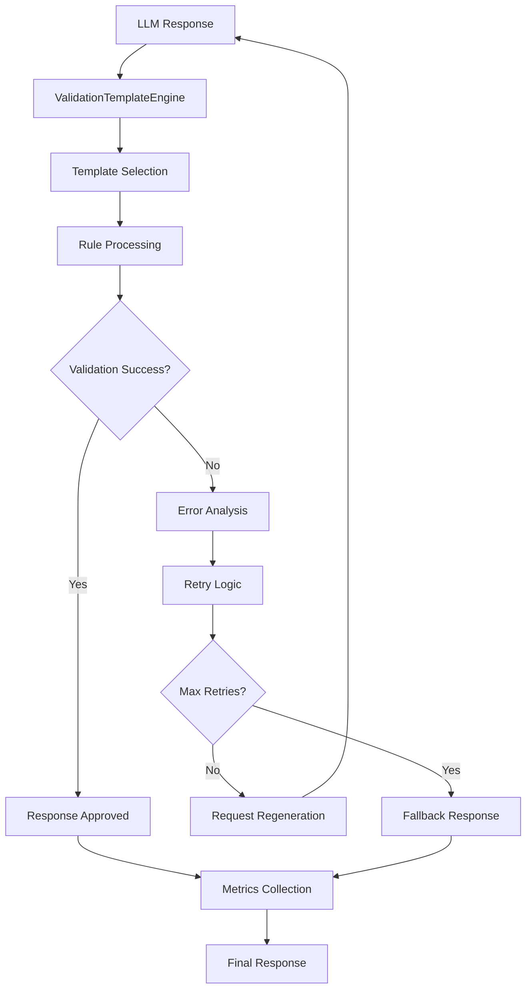

# Design Document

## Overview

Le système de validation des templates LLM est conçu pour garantir que toutes les réponses générées par les LLM respectent des standards de qualité et de structure stricts. Il s'appuie sur un système de templates configurables qui définissent les règles de validation spécifiques à chaque type de persona (simple, B2B, standard).

Le système fonctionne comme un middleware entre la génération LLM et la réponse finale, interceptant et validant chaque réponse avant qu'elle ne soit retournée à l'utilisateur.

## Architecture

### Composants Principaux

1. **ValidationTemplateEngine** - Moteur principal de validation
2. **TemplateRegistry** - Registre des templates de validation
3. **ValidationRuleProcessor** - Processeur des règles de validation
4. **ValidationMetricsCollector** - Collecteur de métriques
5. **ValidationErrorHandler** - Gestionnaire d'erreurs spécialisé

### Flux de Validation



## Components and Interfaces

### ValidationTemplate Interface

```typescript
interface ValidationTemplate {
  id: string;
  name: string;
  version: string;
  personaType: 'simple' | 'b2b' | 'standard';
  rules: ValidationRule[];
  fallbackStrategy: FallbackStrategy;
  metadata: TemplateMetadata;
}

interface ValidationRule {
  id: string;
  type: 'structure' | 'content' | 'format' | 'business';
  field: string;
  validator: ValidatorFunction;
  severity: 'error' | 'warning' | 'info';
  message: string;
  required: boolean;
}

interface ValidatorFunction {
  (value: any, context: ValidationContext): ValidationResult;
}
```

### ValidationEngine Interface

```typescript
interface ValidationEngine {
  validateResponse(
    response: any,
    templateId: string,
    context: ValidationContext
  ): Promise<ValidationResult>;
  
  registerTemplate(template: ValidationTemplate): void;
  getTemplate(id: string): ValidationTemplate | null;
  updateTemplate(id: string, template: ValidationTemplate): void;
}

interface ValidationResult {
  isValid: boolean;
  errors: ValidationError[];
  warnings: ValidationWarning[];
  score: number;
  metadata: ValidationMetadata;
}
```

### Template Registry

```typescript
interface TemplateRegistry {
  templates: Map<string, ValidationTemplate>;
  
  register(template: ValidationTemplate): void;
  get(id: string): ValidationTemplate | null;
  getByPersonaType(type: PersonaType): ValidationTemplate[];
  update(id: string, template: ValidationTemplate): void;
  delete(id: string): boolean;
  list(): ValidationTemplate[];
}
```

## Data Models

### Validation Templates

#### Template Standard Persona
```typescript
const standardPersonaTemplate: ValidationTemplate = {
  id: 'standard-persona-v1',
  name: 'Standard Persona Validation',
  version: '1.0.0',
  personaType: 'standard',
  rules: [
    // Structure validation
    {
      id: 'required-fields',
      type: 'structure',
      field: 'root',
      validator: validateRequiredFields(['id', 'name', 'age', 'occupation']),
      severity: 'error',
      message: 'Missing required fields',
      required: true
    },
    // Content validation
    {
      id: 'age-range',
      type: 'content',
      field: 'age',
      validator: validateAgeRange(18, 80),
      severity: 'error',
      message: 'Age must be between 18 and 80',
      required: true
    },
    // Cultural data validation
    {
      id: 'cultural-data-structure',
      type: 'structure',
      field: 'culturalData',
      validator: validateCulturalDataStructure,
      severity: 'error',
      message: 'Cultural data must contain all required categories',
      required: true
    }
  ],
  fallbackStrategy: {
    type: 'regenerate',
    maxRetries: 3,
    fallbackTemplate: 'simple-persona-v1'
  }
};
```

### Validation Context

```typescript
interface ValidationContext {
  originalRequest: PersonaGenerationRequest;
  templateVariables: Record<string, any>;
  culturalConstraints: CulturalConstraints;
  userSignals: QlooSignals;
  generationAttempt: number;
  previousErrors: ValidationError[];
}
```

### Validation Metrics

```typescript
interface ValidationMetrics {
  templateId: string;
  timestamp: number;
  validationTime: number;
  isValid: boolean;
  errorCount: number;
  warningCount: number;
  score: number;
  retryCount: number;
  fallbackUsed: boolean;
}
```

## Error Handling

### Validation Error Types

```typescript
enum ValidationErrorType {
  STRUCTURE_INVALID = 'STRUCTURE_INVALID',
  REQUIRED_FIELD_MISSING = 'REQUIRED_FIELD_MISSING',
  TYPE_MISMATCH = 'TYPE_MISMATCH',
  VALUE_OUT_OF_RANGE = 'VALUE_OUT_OF_RANGE',
  FORMAT_INVALID = 'FORMAT_INVALID',
  CULTURAL_DATA_INCONSISTENT = 'CULTURAL_DATA_INCONSISTENT',
  BUSINESS_RULE_VIOLATION = 'BUSINESS_RULE_VIOLATION',
  TEMPLATE_NOT_FOUND = 'TEMPLATE_NOT_FOUND',
  VALIDATION_TIMEOUT = 'VALIDATION_TIMEOUT'
}
```

### Error Recovery Strategies

1. **Immediate Retry** - Pour les erreurs de format mineures
2. **Guided Regeneration** - Avec des instructions spécifiques sur les erreurs
3. **Template Fallback** - Utilisation d'un template plus simple
4. **Default Response** - Réponse de secours pré-validée

### Retry Logic

```typescript
interface RetryStrategy {
  maxRetries: number;
  backoffMultiplier: number;
  retryableErrors: ValidationErrorType[];
  enhancePromptOnRetry: boolean;
  fallbackAfterMaxRetries: boolean;
}
```

## Testing Strategy

### Unit Tests
- Validation des règles individuelles
- Test des fonctions de validation
- Validation des templates
- Test des stratégies de fallback

### Integration Tests
- Test du flux complet de validation
- Intégration avec le générateur de personas
- Test des métriques et du monitoring
- Test des différents types de templates

### End-to-End Tests
- Validation avec de vraies réponses LLM
- Test des scénarios d'erreur
- Performance sous charge
- Test des alertes et notifications

### Performance Tests
- Temps de validation par template
- Impact sur le temps de réponse global
- Scalabilité avec multiple validations simultanées
- Optimisation des règles de validation

## Configuration et Déploiement

### Variables d'Environnement

```typescript
interface ValidationConfig {
  VALIDATION_ENABLED: boolean;
  VALIDATION_TIMEOUT_MS: number;
  MAX_VALIDATION_RETRIES: number;
  FALLBACK_ENABLED: boolean;
  METRICS_COLLECTION_ENABLED: boolean;
  ALERT_THRESHOLD_ERROR_RATE: number;
  TEMPLATE_CACHE_TTL: number;
}
```

### Feature Flags

```typescript
interface ValidationFeatureFlags {
  strictValidation: boolean;
  culturalDataValidation: boolean;
  businessRuleValidation: boolean;
  performanceMetrics: boolean;
  alerting: boolean;
}
```

### Monitoring et Alertes

- Taux de validation par template
- Temps de validation moyen
- Taux d'erreur par type
- Utilisation des fallbacks
- Performance des règles de validation