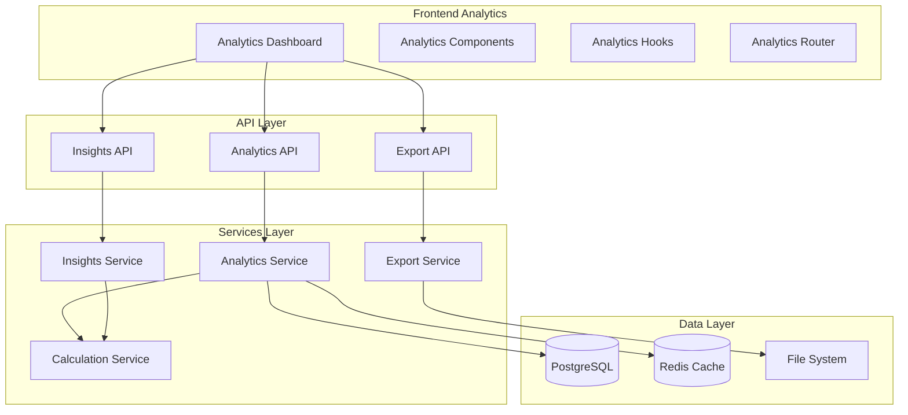
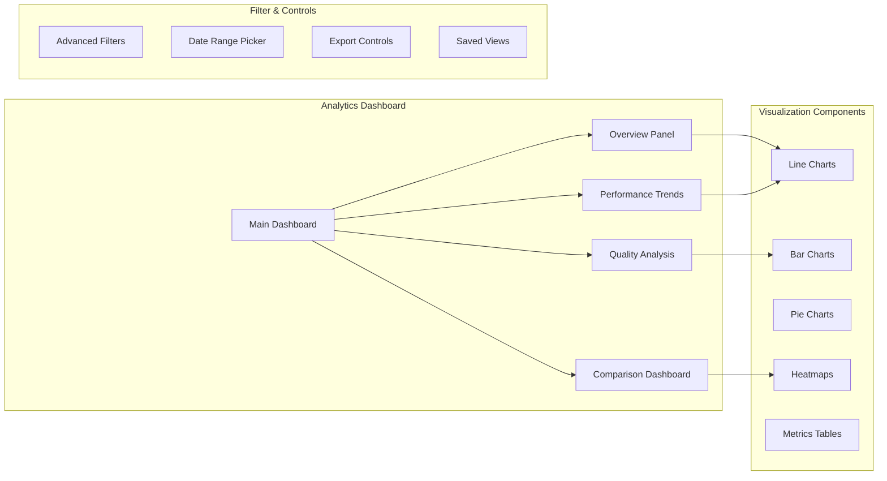

# Design Document

## Overview

Le système d'analytics pour les personas générées est conçu comme une extension du système existant, s'appuyant sur les métadonnées enrichies déjà présentes dans la base de données. Il fournira des insights détaillés sur la performance, la qualité et les tendances des personas générées, avec des visualisations interactives et des capacités d'export avancées.

Le système s'intègre parfaitement avec l'architecture existante en utilisant les interfaces `EnrichedPersona`, `GenerationMetadata`, et `ValidationMetadata` déjà définies, tout en ajoutant de nouvelles couches d'analyse et de visualisation.

## Architecture

### Architecture Globale



### Architecture des Composants Analytics



## Components and Interfaces

### Core Analytics Interfaces

```typescript
// Types d'analytics étendus
interface PersonaAnalyticsData {
  // Métriques de base
  totalPersonas: number;
  averageQualityScore: number;
  averageValidationScore: number;
  averageProcessingTime: number;
  
  // Distribution par sources
  generationSourceDistribution: {
    'qloo-first': number;
    'legacy-fallback': number;
  };
  
  // Distribution par templates
  templateUsageDistribution: Record<string, {
    count: number;
    averageQuality: number;
    averageProcessingTime: number;
  }>;
  
  // Distribution géographique et professionnelle
  locationDistribution: Record<string, number>;
  occupationDistribution: Record<string, number>;
  
  // Métriques de richesse culturelle
  culturalRichnessDistribution: {
    low: number;
    medium: number;
    high: number;
  };
  
  // Tendances temporelles
  timeSeriesData: Array<{
    date: string;
    count: number;
    averageQuality: number;
    averageValidation: number;
    averageProcessingTime: number;
  }>;
  
  // Métriques de performance
  performanceMetrics: {
    successRate: number;
    errorRate: number;
    timeoutRate: number;
    retryRate: number;
  };
}

interface AnalyticsFilters {
  dateRange: [string, string];
  generationSources: string[];
  templates: string[];
  qualityScoreRange: [number, number];
  validationScoreRange: [number, number];
  culturalRichness: string[];
  locations: string[];
  occupations: string[];
}

interface ExportOptions {
  format: 'csv' | 'json' | 'pdf' | 'xlsx';
  includeCharts: boolean;
  includeRawData: boolean;
  dateRange: [string, string];
  filters: AnalyticsFilters;
  sections: string[];
}

interface InsightRecommendation {
  type: 'performance' | 'quality' | 'template' | 'cultural';
  priority: 'low' | 'medium' | 'high' | 'critical';
  title: string;
  description: string;
  impact: string;
  actionItems: string[];
  expectedImprovement: {
    metric: string;
    value: number;
    unit: string;
  };
}
```

### Analytics Service Architecture

```typescript
class PersonaAnalyticsService {
  // Calcul des métriques de base
  async calculateBaseMetrics(filters: AnalyticsFilters): Promise<PersonaAnalyticsData>
  
  // Analyse des tendances temporelles
  async analyzeTrends(timeframe: 'day' | 'week' | 'month', filters: AnalyticsFilters): Promise<TimeSeriesData[]>
  
  // Comparaison de performance entre templates
  async compareTemplatePerformance(templateIds: string[]): Promise<TemplateComparison>
  
  // Analyse de la qualité par segments
  async analyzeQualityBySegments(segmentBy: 'location' | 'occupation' | 'template'): Promise<SegmentAnalysis>
  
  // Génération d'insights automatiques
  async generateInsights(filters: AnalyticsFilters): Promise<InsightRecommendation[]>
  
  // Calcul des corrélations
  async calculateCorrelations(): Promise<CorrelationMatrix>
}
```

## Data Models

### Analytics Data Schema

```sql
-- Table pour stocker les métriques pré-calculées
CREATE TABLE persona_analytics_cache (
  id UUID PRIMARY KEY DEFAULT gen_random_uuid(),
  user_id UUID NOT NULL REFERENCES users(id),
  cache_key VARCHAR(255) NOT NULL,
  data JSONB NOT NULL,
  filters JSONB,
  created_at TIMESTAMP DEFAULT NOW(),
  expires_at TIMESTAMP NOT NULL,
  
  INDEX idx_analytics_cache_user_key (user_id, cache_key),
  INDEX idx_analytics_cache_expires (expires_at)
);

-- Table pour les exports générés
CREATE TABLE persona_exports (
  id UUID PRIMARY KEY DEFAULT gen_random_uuid(),
  user_id UUID NOT NULL REFERENCES users(id),
  export_type VARCHAR(50) NOT NULL,
  format VARCHAR(10) NOT NULL,
  filters JSONB,
  file_path VARCHAR(500),
  status VARCHAR(20) DEFAULT 'pending',
  created_at TIMESTAMP DEFAULT NOW(),
  completed_at TIMESTAMP,
  error_message TEXT,
  
  INDEX idx_exports_user_status (user_id, status),
  INDEX idx_exports_created (created_at)
);

-- Table pour les vues sauvegardées
CREATE TABLE saved_analytics_views (
  id UUID PRIMARY KEY DEFAULT gen_random_uuid(),
  user_id UUID NOT NULL REFERENCES users(id),
  name VARCHAR(100) NOT NULL,
  description TEXT,
  filters JSONB NOT NULL,
  chart_configs JSONB,
  is_default BOOLEAN DEFAULT FALSE,
  created_at TIMESTAMP DEFAULT NOW(),
  updated_at TIMESTAMP DEFAULT NOW(),
  
  INDEX idx_saved_views_user (user_id)
);

-- Table pour les insights générés
CREATE TABLE persona_insights (
  id UUID PRIMARY KEY DEFAULT gen_random_uuid(),
  user_id UUID NOT NULL REFERENCES users(id),
  insight_type VARCHAR(50) NOT NULL,
  priority VARCHAR(20) NOT NULL,
  title VARCHAR(200) NOT NULL,
  description TEXT NOT NULL,
  recommendations JSONB,
  is_read BOOLEAN DEFAULT FALSE,
  is_dismissed BOOLEAN DEFAULT FALSE,
  created_at TIMESTAMP DEFAULT NOW(),
  
  INDEX idx_insights_user_unread (user_id, is_read),
  INDEX idx_insights_priority (priority, created_at)
);
```

### Extended Persona Analytics Views

```sql
-- Vue pour les analytics agrégées par utilisateur
CREATE VIEW user_persona_analytics AS
SELECT 
  p.user_id,
  COUNT(*) as total_personas,
  AVG(p.quality_score) as avg_quality_score,
  AVG((p.validation_metadata->>'validationScore')::float) as avg_validation_score,
  AVG(p.processing_time) as avg_processing_time,
  COUNT(CASE WHEN p.generation_metadata->>'source' = 'qloo-first' THEN 1 END) as qloo_first_count,
  COUNT(CASE WHEN p.generation_metadata->>'source' = 'legacy-fallback' THEN 1 END) as legacy_count,
  MIN(p.created_at) as first_persona_date,
  MAX(p.created_at) as last_persona_date
FROM personas p
GROUP BY p.user_id;

-- Vue pour les tendances temporelles
CREATE VIEW persona_daily_trends AS
SELECT 
  p.user_id,
  DATE(p.created_at) as date,
  COUNT(*) as daily_count,
  AVG(p.quality_score) as daily_avg_quality,
  AVG((p.validation_metadata->>'validationScore')::float) as daily_avg_validation,
  AVG(p.processing_time) as daily_avg_processing_time
FROM personas p
GROUP BY p.user_id, DATE(p.created_at)
ORDER BY date DESC;
```

## Error Handling

### Analytics Error Management

```typescript
class AnalyticsError extends Error {
  constructor(
    message: string,
    public code: string,
    public context?: any
  ) {
    super(message);
    this.name = 'AnalyticsError';
  }
}

// Types d'erreurs spécifiques
const ANALYTICS_ERROR_CODES = {
  CALCULATION_FAILED: 'CALCULATION_FAILED',
  INSUFFICIENT_DATA: 'INSUFFICIENT_DATA',
  EXPORT_FAILED: 'EXPORT_FAILED',
  CACHE_ERROR: 'CACHE_ERROR',
  INSIGHT_GENERATION_FAILED: 'INSIGHT_GENERATION_FAILED'
} as const;

// Gestionnaire d'erreurs centralisé
class AnalyticsErrorHandler {
  static handle(error: Error, context: string): AnalyticsResponse {
    if (error instanceof AnalyticsError) {
      return {
        success: false,
        error: {
          code: error.code,
          message: error.message,
          context: error.context
        }
      };
    }
    
    // Log des erreurs inattendues
    console.error(`Analytics error in ${context}:`, error);
    
    return {
      success: false,
      error: {
        code: 'UNKNOWN_ERROR',
        message: 'Une erreur inattendue s\'est produite'
      }
    };
  }
}
```

## Testing Strategy

### Test Architecture

```typescript
// Tests unitaires pour les services d'analytics
describe('PersonaAnalyticsService', () => {
  describe('calculateBaseMetrics', () => {
    it('should calculate correct metrics for given filters');
    it('should handle empty dataset gracefully');
    it('should apply filters correctly');
  });
  
  describe('analyzeTrends', () => {
    it('should generate correct time series data');
    it('should handle different timeframes');
    it('should interpolate missing data points');
  });
});

// Tests d'intégration pour l'API
describe('Analytics API', () => {
  describe('GET /api/analytics', () => {
    it('should return analytics data for authenticated user');
    it('should apply filters correctly');
    it('should handle pagination');
  });
  
  describe('POST /api/analytics/export', () => {
    it('should generate export in requested format');
    it('should include filtered data only');
    it('should handle large datasets');
  });
});

// Tests de performance
describe('Analytics Performance', () => {
  it('should calculate metrics within acceptable time limits');
  it('should use cache effectively');
  it('should handle concurrent requests');
});
```

### Test Data Strategy

```typescript
// Factory pour générer des données de test
class PersonaAnalyticsTestDataFactory {
  static createPersonaWithMetadata(overrides?: Partial<EnrichedPersona>): EnrichedPersona;
  static createAnalyticsDataset(size: number, options?: DatasetOptions): EnrichedPersona[];
  static createTimeSeriesData(days: number, trendsConfig?: TrendsConfig): TimeSeriesData[];
}

// Mocks pour les services externes
const mockAnalyticsService = {
  calculateBaseMetrics: jest.fn(),
  analyzeTrends: jest.fn(),
  generateInsights: jest.fn()
};
```

## Performance Considerations

### Optimisation des Calculs

1. **Cache Multi-Niveaux**
   - Cache Redis pour les métriques fréquemment demandées
   - Cache en base pour les calculs complexes
   - Cache navigateur pour les données statiques

2. **Calculs Asynchrones**
   - Background jobs pour les métriques lourdes
   - Streaming des résultats pour les gros datasets
   - Pagination intelligente

3. **Indexation Optimisée**
   - Index composites sur les champs de filtrage
   - Index partiels pour les requêtes fréquentes
   - Statistiques de table maintenues à jour

### Stratégie de Cache

```typescript
class AnalyticsCacheManager {
  // Cache des métriques de base (TTL: 1 heure)
  async cacheBaseMetrics(userId: string, filters: AnalyticsFilters, data: PersonaAnalyticsData): Promise<void>
  
  // Cache des tendances (TTL: 6 heures)
  async cacheTrends(userId: string, timeframe: string, data: TimeSeriesData[]): Promise<void>
  
  // Invalidation intelligente du cache
  async invalidateUserCache(userId: string, reason: 'new_persona' | 'updated_persona' | 'deleted_persona'): Promise<void>
  
  // Pré-calcul des métriques populaires
  async precomputePopularMetrics(): Promise<void>
}
```

## Security and Privacy

### Sécurité des Données

1. **Isolation des Données Utilisateur**
   - Toutes les requêtes filtrées par `userId`
   - Validation stricte des permissions
   - Audit trail des accès aux analytics

2. **Anonymisation pour les Analytics Globales**
   - Suppression des données personnelles
   - Agrégation minimale pour préserver la confidentialité
   - Respect du RGPD

3. **Sécurisation des Exports**
   - Chiffrement des fichiers temporaires
   - Nettoyage automatique des exports
   - Limitation de la taille des exports

### Contrôle d'Accès

```typescript
class AnalyticsAccessControl {
  // Vérification des permissions utilisateur
  async canAccessAnalytics(userId: string): Promise<boolean>
  
  // Vérification des permissions d'export
  async canExportData(userId: string, format: string): Promise<boolean>
  
  // Limitation du taux de requêtes
  async checkRateLimit(userId: string, endpoint: string): Promise<boolean>
  
  // Audit des accès
  async logAccess(userId: string, action: string, metadata?: any): Promise<void>
}
```

## Integration Points

### Intégration avec l'Écosystème Existant

1. **PersonaContext Integration**
   - Extension du contexte existant avec les analytics
   - Hooks réutilisables pour les composants
   - État partagé pour les filtres

2. **API Consistency**
   - Même patterns d'authentification
   - Gestion d'erreurs cohérente
   - Format de réponse standardisé

3. **UI Component Reuse**
   - Réutilisation des composants de filtrage existants
   - Cohérence avec le design system
   - Responsive design patterns

### Points d'Extension

```typescript
// Interface pour les plugins d'analytics
interface AnalyticsPlugin {
  name: string;
  version: string;
  calculateCustomMetrics(personas: EnrichedPersona[]): Promise<CustomMetrics>;
  renderCustomVisualization(data: CustomMetrics): React.ComponentType;
}

// Registry des plugins
class AnalyticsPluginRegistry {
  static register(plugin: AnalyticsPlugin): void;
  static getPlugin(name: string): AnalyticsPlugin | null;
  static listPlugins(): AnalyticsPlugin[];
}
```