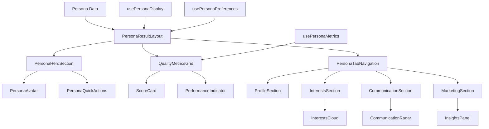

# Design Document - Refonte Totale Affichage Résultats Persona

## Overview

Ce document présente l'architecture et le design détaillé pour la refonte complète de l'affichage des résultats de persona dans PersonaCraft. La solution propose une expérience utilisateur moderne, performante et accessible, utilisant Tailwind CSS 4 avec un système de design cohérent.

L'approche se base sur une architecture modulaire avec des composants réutilisables, des micro-interactions fluides, et une optimisation pour tous les appareils et contextes d'utilisation.

## Architecture

### Structure Globale

```
PersonaResultRedesign/
├── components/
│   ├── layout/
│   │   ├── PersonaResultLayout.tsx      # Layout principal avec navigation
│   │   ├── PersonaHeader.tsx            # En-tête avec actions principales
│   │   └── PersonaBreadcrumbs.tsx       # Navigation contextuelle
│   ├── hero/
│   │   ├── PersonaHeroSection.tsx       # Section hero avec avatar et infos clés
│   │   ├── PersonaAvatar.tsx            # Avatar avec animations
│   │   └── PersonaQuickActions.tsx      # Actions rapides (export, partage)
│   ├── metrics/
│   │   ├── QualityMetricsGrid.tsx       # Grille des métriques de qualité
│   │   ├── ScoreCard.tsx                # Carte de score individuelle
│   │   ├── PerformanceIndicator.tsx     # Indicateur de performance
│   │   └── MetricsTooltip.tsx           # Tooltips explicatifs
│   ├── content/
│   │   ├── PersonaTabNavigation.tsx     # Navigation par onglets
│   │   ├── ProfileSection.tsx           # Section profil démographique
│   │   ├── InterestsSection.tsx         # Section intérêts et culture
│   │   ├── CommunicationSection.tsx     # Section communication
│   │   └── MarketingSection.tsx         # Section insights marketing
│   ├── visualizations/
│   │   ├── InterestsCloud.tsx           # Cloud de tags interactif
│   │   ├── CommunicationRadar.tsx       # Graphique radar préférences
│   │   ├── CulturalDataGrid.tsx         # Grille données culturelles
│   │   └── InsightsPanel.tsx            # Panel insights et recommandations
│   └── ui/
│       ├── AnimatedCard.tsx             # Carte avec animations
│       ├── GradientButton.tsx           # Boutons avec gradients
│       ├── LoadingSkeleton.tsx          # Skeletons de chargement
│       └── StatusIndicator.tsx          # Indicateurs d'état
├── hooks/
│   ├── usePersonaDisplay.ts             # Hook pour gestion affichage
│   ├── usePersonaMetrics.ts             # Hook pour calcul métriques
│   ├── usePersonaExport.ts              # Hook pour export avancé
│   └── usePersonaPreferences.ts         # Hook pour préférences utilisateur
├── styles/
│   ├── persona-result.css               # Styles spécifiques
│   └── animations.css                   # Animations personnalisées
└── types/
    ├── persona-display.ts               # Types pour affichage
    └── persona-metrics.ts               # Types pour métriques
```

### Flux de Données



## Components and Interfaces

### 1. Layout Principal (PersonaResultLayout)

**Responsabilité:** Container principal avec navigation et structure globale

```typescript
interface PersonaResultLayoutProps {
  persona: EnhancedPersona;
  viewMode: 'detailed' | 'compact';
  onViewModeChange: (mode: 'detailed' | 'compact') => void;
  children: React.ReactNode;
}

interface LayoutState {
  activeTab: string;
  sidebarOpen: boolean;
  preferences: UserPreferences;
}
```

**Design Features:**
- Header fixe avec actions contextuelles
- Sidebar responsive pour navigation rapide
- Breadcrumbs avec historique de navigation
- Support complet clavier et lecteurs d'écran

### 2. Section Hero (PersonaHeroSection)

**Responsabilité:** Présentation visuelle principale du persona

```typescript
interface PersonaHeroProps {
  persona: EnhancedPersona;
  showActions?: boolean;
  compact?: boolean;
}

interface HeroElements {
  avatar: AvatarConfig;
  primaryInfo: PersonaBasicInfo;
  quickStats: QuickMetrics;
  actions: ActionButton[];
}
```

**Design Features:**
- Avatar circulaire avec border gradient animé
- Cards flottantes avec glass effect pour infos clés
- Citation/tagline mise en valeur
- Actions principales accessibles (export, partage, retour)

### 3. Métriques de Qualité (QualityMetricsGrid)

**Responsabilité:** Affichage des scores et métriques de performance

```typescript
interface QualityMetricsProps {
  metrics: PersonaValidationMetrics;
  showDetails?: boolean;
  interactive?: boolean;
}

interface MetricCard {
  type: 'completeness' | 'consistency' | 'realism' | 'performance';
  score: number;
  trend?: 'up' | 'down' | 'stable';
  details: MetricDetails;
}
```

**Design Features:**
- Graphiques circulaires animés pour les scores
- Barres de progression avec étapes
- Indicateurs visuels colorés par performance
- Tooltips avec explications détaillées

### 4. Navigation par Onglets (PersonaTabNavigation)

**Responsabilité:** Organisation du contenu en sections logiques

```typescript
interface TabNavigationProps {
  activeTab: string;
  onTabChange: (tab: string) => void;
  tabs: TabConfig[];
  showBadges?: boolean;
}

interface TabConfig {
  id: string;
  label: string;
  icon: React.ComponentType;
  badge?: string | number;
  disabled?: boolean;
}
```

**Design Features:**
- Style moderne inspiré de Notion/Linear
- Indicateurs visuels pour contenu disponible
- Transitions fluides entre onglets
- Support navigation clavier complète

### 5. Visualisations Interactives

#### InterestsCloud
```typescript
interface InterestsCloudProps {
  interests: CulturalInterest[];
  categories: InterestCategory[];
  onInterestClick?: (interest: CulturalInterest) => void;
  filterBy?: string[];
}
```

#### CommunicationRadar
```typescript
interface CommunicationRadarProps {
  preferences: CommunicationPreferences;
  channels: CommunicationChannel[];
  interactive?: boolean;
}
```

## Data Models

### Enhanced Persona Display Model

```typescript
interface PersonaDisplayConfig {
  theme: 'light' | 'dark' | 'auto';
  layout: 'compact' | 'detailed';
  animations: boolean;
  accessibility: {
    reducedMotion: boolean;
    highContrast: boolean;
    fontSize: 'small' | 'medium' | 'large';
  };
}

interface PersonaMetrics {
  qualityScore: number;
  completionScore: number;
  engagementLevel: 'low' | 'medium' | 'high';
  dataRichness: number;
  culturalAccuracy: number;
  marketingRelevance: number;
}

interface PersonaVisualizationData {
  interestsCloud: TagCloudData[];
  communicationRadar: RadarDataPoint[];
  demographicCharts: ChartData[];
  culturalInsights: InsightData[];
}
```

### User Preferences Model

```typescript
interface UserPreferences {
  displayMode: 'grid' | 'list' | 'cards';
  defaultView: 'overview' | 'detailed';
  autoSave: boolean;
  notifications: NotificationSettings;
  exportDefaults: ExportSettings;
}

interface NotificationSettings {
  showTooltips: boolean;
  animateTransitions: boolean;
  soundEffects: boolean;
}
```

## Error Handling

### Error Boundary Strategy

```typescript
interface PersonaErrorBoundary {
  fallbackComponent: React.ComponentType<ErrorFallbackProps>;
  onError: (error: Error, errorInfo: ErrorInfo) => void;
  resetKeys: string[];
}

interface ErrorStates {
  dataLoadError: 'retry' | 'fallback' | 'redirect';
  renderError: 'skeleton' | 'message' | 'reload';
  networkError: 'offline' | 'timeout' | 'server';
}
```

### Graceful Degradation

1. **Données manquantes:** Affichage de placeholders informatifs
2. **Erreurs de rendu:** Fallback vers version simplifiée
3. **Problèmes réseau:** Mode offline avec données cachées
4. **Erreurs JavaScript:** Error boundaries avec options de récupération

## Testing Strategy

### Unit Testing

```typescript
// Exemple de tests pour composants clés
describe('PersonaHeroSection', () => {
  test('renders persona information correctly');
  test('handles missing avatar gracefully');
  test('displays quality metrics accurately');
  test('supports keyboard navigation');
});

describe('QualityMetricsGrid', () => {
  test('calculates scores correctly');
  test('animates score changes');
  test('shows appropriate tooltips');
  test('handles edge cases (0%, 100%)');
});
```

### Integration Testing

```typescript
describe('PersonaResultLayout Integration', () => {
  test('tab navigation updates content correctly');
  test('export functionality works end-to-end');
  test('responsive breakpoints function properly');
  test('accessibility features work together');
});
```

### Visual Regression Testing

- Screenshots automatisés pour tous les breakpoints
- Tests de contraste et lisibilité
- Validation des animations et transitions
- Tests cross-browser pour compatibilité

## Performance Optimizations

### Code Splitting

```typescript
// Lazy loading des onglets non critiques
const ProfileSection = lazy(() => import('./ProfileSection'));
const InterestsSection = lazy(() => import('./InterestsSection'));
const CommunicationSection = lazy(() => import('./CommunicationSection'));
const MarketingSection = lazy(() => import('./MarketingSection'));
```

### Memoization Strategy

```typescript
// Memoization des calculs coûteux
const MemoizedMetricsGrid = memo(QualityMetricsGrid, (prev, next) => {
  return prev.metrics.qualityScore === next.metrics.qualityScore &&
         prev.metrics.completionScore === next.metrics.completionScore;
});

const MemoizedVisualization = memo(InterestsCloud, (prev, next) => {
  return JSON.stringify(prev.interests) === JSON.stringify(next.interests);
});
```

### Virtual Scrolling

Pour les listes longues d'intérêts ou de données culturelles :

```typescript
interface VirtualScrollConfig {
  itemHeight: number;
  containerHeight: number;
  overscan: number;
  threshold: number;
}
```

## Accessibility Implementation

### WCAG 2.1 AA Compliance

1. **Navigation Clavier**
   - Focus management avec skip links
   - Ordre de tabulation logique
   - Raccourcis clavier pour actions principales

2. **Lecteurs d'Écran**
   - ARIA labels et descriptions
   - Live regions pour changements dynamiques
   - Structure sémantique appropriée

3. **Contraste et Lisibilité**
   - Ratio de contraste minimum 4.5:1
   - Tailles de police adaptatives
   - Support pour préférences système

4. **Mouvement et Animations**
   - Respect de `prefers-reduced-motion`
   - Alternatives statiques pour animations
   - Contrôles de lecture/pause

### Implementation Example

```typescript
const useAccessibility = () => {
  const [reducedMotion] = useMediaQuery('(prefers-reduced-motion: reduce)');
  const [highContrast] = useMediaQuery('(prefers-contrast: high)');
  
  return {
    animationDuration: reducedMotion ? 0 : 300,
    contrastMode: highContrast ? 'high' : 'normal',
    focusVisible: true
  };
};
```

## Design System Integration

### Tailwind CSS 4 Configuration

```css
/* Variables CSS personnalisées pour PersonaCraft */
:root {
  /* Couleurs principales */
  --color-persona-primary: oklch(0.65 0.15 260);
  --color-persona-secondary: oklch(0.55 0.12 180);
  --color-persona-accent: oklch(0.75 0.18 45);
  
  /* Métriques de qualité */
  --color-quality-excellent: oklch(0.65 0.15 140);
  --color-quality-good: oklch(0.75 0.15 60);
  --color-quality-average: oklch(0.65 0.18 15);
  
  /* Espacements */
  --spacing-persona-xs: 0.25rem;
  --spacing-persona-sm: 0.5rem;
  --spacing-persona-md: 1rem;
  --spacing-persona-lg: 1.5rem;
  --spacing-persona-xl: 2rem;
  
  /* Animations */
  --animation-duration-fast: 150ms;
  --animation-duration-normal: 300ms;
  --animation-duration-slow: 500ms;
  
  /* Ombres */
  --shadow-persona-sm: 0 1px 2px 0 rgb(0 0 0 / 0.05);
  --shadow-persona-md: 0 4px 6px -1px rgb(0 0 0 / 0.1);
  --shadow-persona-lg: 0 10px 15px -3px rgb(0 0 0 / 0.1);
  --shadow-persona-xl: 0 20px 25px -5px rgb(0 0 0 / 0.1);
}

/* Classes utilitaires personnalisées */
.persona-card {
  @apply bg-white dark:bg-gray-800 rounded-xl shadow-persona-md border border-gray-200 dark:border-gray-700;
  @apply hover:shadow-persona-lg hover:-translate-y-1 transition-all duration-300;
}

.persona-gradient {
  @apply bg-gradient-to-br from-persona-primary to-persona-secondary;
}

.persona-glass {
  @apply bg-white/80 dark:bg-gray-800/80 backdrop-blur-sm;
}

/* Animations personnalisées */
@keyframes persona-fade-in {
  from { opacity: 0; transform: translateY(10px); }
  to { opacity: 1; transform: translateY(0); }
}

@keyframes persona-scale-in {
  from { opacity: 0; transform: scale(0.95); }
  to { opacity: 1; transform: scale(1); }
}

.persona-animate-in {
  animation: persona-fade-in var(--animation-duration-normal) ease-out;
}

.persona-animate-scale {
  animation: persona-scale-in var(--animation-duration-normal) ease-out;
}
```

### Component Styling Patterns

```typescript
// Système de variants pour composants
const cardVariants = {
  default: "persona-card",
  elevated: "persona-card shadow-persona-xl",
  glass: "persona-glass rounded-xl border border-white/20",
  gradient: "persona-gradient text-white shadow-persona-lg"
};

const buttonVariants = {
  primary: "persona-gradient text-white hover:opacity-90",
  secondary: "bg-gray-100 dark:bg-gray-700 hover:bg-gray-200 dark:hover:bg-gray-600",
  ghost: "hover:bg-gray-100 dark:hover:bg-gray-700"
};
```

Cette architecture de design assure une expérience utilisateur cohérente, performante et accessible, tout en maintenant la flexibilité nécessaire pour les évolutions futures de PersonaCraft.