# Design Document

## Overview

Cette fonctionnalité met à jour l'interface utilisateur pour tirer parti des améliorations apportées par le système Qloo First et les templates de validation. Le design se concentre sur l'affichage des nouvelles métadonnées, l'enrichissement de la page de détail des personas, et la mise à jour de la structure de base de données tout en maintenant la rétrocompatibilité avec les personas existants.

## Architecture

### Flux de données mis à jour

```mermaid
sequenceDiagram
    participant UI as Interface Utilisateur
    participant API as API Personas
    participant DB as Base de données
    participant QF as Qloo First Generator
    participant VT as Validation Templates
    
    UI->>API: Récupérer personas
    API->>DB: Query personas avec métadonnées
    DB-->>API: Personas + métadonnées enrichies
    API-->>UI: Personas avec indicateurs de source
    
    Note over UI: Affichage différencié selon la source
    
    UI->>API: Générer nouveau persona
    API->>QF: Génération avec Qloo First
    QF->>VT: Validation avec templates
    VT-->>QF: Résultat validé + métadonnées
    QF-->>API: Persona enrichi + métadonnées
    API->>DB: Sauvegarder avec métadonnées complètes
    DB-->>API: Confirmation
    API-->>UI: Persona avec indicateurs de qualité
```



### Structure des métadonnées étendues


## Components and Interfaces

### 1. Enhanced Persona Types

```typescript
// Extension des types existants
interface GenerationMetadata {
  source: 'qloo-first' | 'legacy-fallback';
  method: string;
  culturalConstraintsUsed: string[];
  processingTime: number;
  qlooDataUsed: boolean;
  templateUsed?: string;
  fallbackReason?: string;
  cacheHitRate?: number;
  generatedAt: string;
}

interface ValidationMetadata {
  templateName: string;
  validationScore: number;
  validationDetails: ValidationDetail[];
  failedRules: string[];
  passedRules: string[];
  validationTime: number;
}

interface ValidationDetail {
  rule: string;
  passed: boolean;
  score: number;
  message: string;
  category: 'format' | 'content' | 'cultural' | 'demographic';
}

interface EnrichedPersona extends Persona {
  metadata?: GenerationMetadata;
  validationData?: ValidationMetadata;
}
```

### 2. Database Schema Updates

```sql
-- Migration pour ajouter les nouvelles colonnes
ALTER TABLE "Persona" ADD COLUMN "generationMetadata" JSONB;
ALTER TABLE "Persona" ADD COLUMN "validationMetadata" JSONB;
ALTER TABLE "Persona" ADD COLUMN "culturalDataSource" VARCHAR(50) DEFAULT 'unknown';
ALTER TABLE "Persona" ADD COLUMN "templateUsed" VARCHAR(100);
ALTER TABLE "Persona" ADD COLUMN "processingTime" INTEGER;

-- Index pour améliorer les performances de filtrage
CREATE INDEX idx_persona_generation_source ON "Persona" USING GIN ((generationMetadata->>'source'));
CREATE INDEX idx_persona_validation_score ON "Persona" ((CAST(validationMetadata->>'validationScore' AS INTEGER)));
CREATE INDEX idx_persona_cultural_source ON "Persona" (culturalDataSource);
```

### 3. UI Components Architecture

```typescript
// Composant principal de carte persona mise à jour
interface PersonaCardProps {
  persona: EnrichedPersona;
  onSelect: (persona: EnrichedPersona) => void;
  onDelete: (id: string) => void;
  showMetadata?: boolean;
}

// Composant pour afficher les badges de métadonnées
interface MetadataBadgeProps {
  metadata: GenerationMetadata;
  size?: 'sm' | 'md' | 'lg';
  variant?: 'compact' | 'detailed';
}

// Composant pour la section de validation
interface ValidationSectionProps {
  validationData: ValidationMetadata;
  showDetails?: boolean;
}

// Composant pour les données culturelles enrichies
interface CulturalDataSectionProps {
  culturalData: CulturalData;
  metadata?: GenerationMetadata;
  showSource?: boolean;
}
```

### 4. Enhanced Persona List Component

```typescript
interface EnhancedPersonaListProps {
  personas: EnrichedPersona[];
  filters: PersonaFilters & {
    generationSource?: ('qloo-first' | 'legacy-fallback')[];
    validationScore?: [number, number];
    culturalDataRichness?: 'low' | 'medium' | 'high';
  };
  sortOptions: SortOptions & {
    field: keyof EnrichedPersona | 'validationScore' | 'culturalRichness';
  };
}

class EnhancedPersonaList extends React.Component<EnhancedPersonaListProps> {
  renderPersonaCard(persona: EnrichedPersona): JSX.Element;
  renderMetadataBadges(metadata: GenerationMetadata): JSX.Element;
  renderQualityIndicators(persona: EnrichedPersona): JSX.Element;
  calculateCulturalRichness(culturalData: CulturalData): 'low' | 'medium' | 'high';
}
```

### 5. Enhanced Persona Detail Page

```typescript
interface PersonaDetailPageProps {
  personaId: string;
}

interface PersonaDetailTabs {
  overview: OverviewTabProps;
  demographics: DemographicsTabProps;
  psychographics: PsychographicsTabProps;
  cultural: CulturalTabProps; // Nouvelle section
  validation: ValidationTabProps; // Nouvelle section
  metadata: MetadataTabProps; // Nouvelle section
}

// Nouveau composant pour l'onglet culturel
interface CulturalTabProps {
  culturalData: CulturalData;
  metadata?: GenerationMetadata;
}

// Nouveau composant pour l'onglet validation
interface ValidationTabProps {
  validationData?: ValidationMetadata;
  qualityScore: number;
}

// Nouveau composant pour l'onglet métadonnées
interface MetadataTabProps {
  metadata?: GenerationMetadata;
  createdAt: string;
  updatedAt?: string;
}
```

## Data Models

### Enhanced Persona Model (Prisma)

```prisma
model Persona {
  id                   String   @id @default(uuid())
  userId               String
  user                 User     @relation(fields: [userId], references: [id])
  name                 String
  age                  Int
  occupation           String
  location             String
  bio                  String?
  quote                String?
  demographics         Json
  psychographics       Json
  culturalData         Json
  painPoints           String[]
  goals                String[]
  marketingInsights    Json
  qualityScore         Float
  
  // Nouvelles colonnes pour les métadonnées
  generationMetadata   Json?
  validationMetadata   Json?
  culturalDataSource   String   @default("unknown")
  templateUsed         String?
  processingTime       Int?
  
  createdAt            DateTime @default(now())
  updatedAt            DateTime @updatedAt
  
  @@index([culturalDataSource])
  @@index([templateUsed])
}
```

### API Response Models

```typescript
interface PersonaListResponse {
  personas: EnrichedPersona[];
  metadata: {
    total: number;
    qlooFirstCount: number;
    legacyCount: number;
    averageValidationScore: number;
    averageProcessingTime: number;
  };
  filters: {
    availableSources: string[];
    validationScoreRange: [number, number];
    templatesUsed: string[];
  };
}

interface PersonaDetailResponse {
  persona: EnrichedPersona;
  relatedPersonas?: EnrichedPersona[];
  comparisonData?: {
    averageScores: {
      quality: number;
      validation: number;
      culturalRichness: number;
    };
    sourceDistribution: Record<string, number>;
  };
}
```

## UI Design Specifications

### 1. Metadata Badges Design

```typescript
const MetadataBadgeStyles = {
  'qloo-first': {
    bg: 'bg-gradient-to-r from-green-500 to-emerald-600',
    text: 'text-white',
    icon: '🎯',
    label: 'Qloo First'
  },
  'legacy-fallback': {
    bg: 'bg-gradient-to-r from-amber-500 to-orange-600',
    text: 'text-white',
    icon: '⚡',
    label: 'Legacy'
  },
  'high-validation': {
    bg: 'bg-gradient-to-r from-blue-500 to-indigo-600',
    text: 'text-white',
    icon: '✓',
    label: 'Validé'
  }
};
```

### 2. Cultural Data Visualization

```typescript
interface CulturalDataVisualization {
  categories: {
    music: { items: string[]; source: string; confidence: number };
    brands: { items: string[]; source: string; confidence: number };
    restaurants: { items: string[]; source: string; confidence: number };
    // ... autres catégories
  };
  richness: 'low' | 'medium' | 'high';
  sourceIndicator: 'qloo' | 'fallback' | 'mixed';
}

const CulturalDataCard = ({ category, data }: { category: string; data: any }) => (
  <div className="bg-white rounded-xl border border-slate-200 p-6">
    <div className="flex items-center justify-between mb-4">
      <h4 className="font-semibold text-slate-900 capitalize">{category}</h4>
      <div className="flex items-center space-x-2">
        <SourceBadge source={data.source} />
        <ConfidenceMeter confidence={data.confidence} />
      </div>
    </div>
    <div className="flex flex-wrap gap-2">
      {data.items.map((item: string, index: number) => (
        <span key={index} className="px-3 py-1 bg-slate-100 text-slate-700 rounded-full text-sm">
          {item}
        </span>
      ))}
    </div>
  </div>
);
```

### 3. Validation Score Visualization

```typescript
const ValidationScoreDisplay = ({ validationData }: { validationData: ValidationMetadata }) => (
  <div className="bg-gradient-to-br from-blue-50 to-indigo-50 rounded-xl p-6">
    <div className="flex items-center justify-between mb-4">
      <h3 className="text-xl font-bold text-slate-900">Score de Validation</h3>
      <div className="text-3xl font-bold text-indigo-600">
        {validationData.validationScore}%
      </div>
    </div>
    
    <div className="space-y-3">
      <div className="flex justify-between text-sm">
        <span className="text-green-600">✓ Règles respectées</span>
        <span className="font-semibold">{validationData.passedRules.length}</span>
      </div>
      <div className="flex justify-between text-sm">
        <span className="text-red-600">✗ Règles échouées</span>
        <span className="font-semibold">{validationData.failedRules.length}</span>
      </div>
    </div>
    
    <div className="mt-4 bg-white rounded-lg p-3">
      <div className="text-xs text-slate-600 mb-2">Template utilisé</div>
      <div className="font-medium text-slate-900">{validationData.templateName}</div>
    </div>
  </div>
);
```

## Error Handling

### Backward Compatibility

```typescript
// Fonction utilitaire pour gérer la rétrocompatibilité
const normalizePersona = (persona: Partial<EnrichedPersona>): EnrichedPersona => {
  return {
    ...persona,
    metadata: persona.metadata || {
      source: 'legacy-fallback',
      method: 'unknown',
      culturalConstraintsUsed: [],
      processingTime: 0,
      qlooDataUsed: false,
      generatedAt: persona.createdAt || new Date().toISOString()
    },
    validationData: persona.validationData || {
      templateName: 'legacy',
      validationScore: persona.qualityScore || 0,
      validationDetails: [],
      failedRules: [],
      passedRules: [],
      validationTime: 0
    }
  } as EnrichedPersona;
};

// Composant wrapper pour gérer les erreurs d'affichage
const SafePersonaDisplay = ({ persona, children }: { persona: any; children: React.ReactNode }) => {
  try {
    const normalizedPersona = normalizePersona(persona);
    return <PersonaProvider persona={normalizedPersona}>{children}</PersonaProvider>;
  } catch (error) {
    return <PersonaErrorFallback error={error} persona={persona} />;
  }
};
```

## Testing Strategy

### Unit Tests

```typescript
describe('Enhanced Persona Components', () => {
  describe('MetadataBadge', () => {
    it('should display qloo-first badge correctly');
    it('should display legacy-fallback badge correctly');
    it('should handle missing metadata gracefully');
  });
  
  describe('CulturalDataSection', () => {
    it('should render cultural data by category');
    it('should show source indicators');
    it('should handle empty cultural data');
  });
  
  describe('ValidationSection', () => {
    it('should display validation scores');
    it('should show passed/failed rules');
    it('should handle missing validation data');
  });
});
```

### Integration Tests

```typescript
describe('Enhanced Persona Pages', () => {
  it('should load and display personas with metadata');
  it('should filter personas by generation source');
  it('should sort personas by validation score');
  it('should handle mixed legacy and new personas');
  it('should display detailed view with all sections');
});
```

## Performance Considerations

### Database Optimization

```sql
-- Index composites pour les requêtes fréquentes
CREATE INDEX idx_persona_source_score ON "Persona" 
  USING BTREE ((generationMetadata->>'source'), qualityScore DESC);

CREATE INDEX idx_persona_validation_template ON "Persona" 
  USING BTREE ((validationMetadata->>'templateName'), (validationMetadata->>'validationScore'));
```

### Frontend Optimization

```typescript
// Lazy loading des sections détaillées
const CulturalDataSection = React.lazy(() => import('./CulturalDataSection'));
const ValidationSection = React.lazy(() => import('./ValidationSection'));
const MetadataSection = React.lazy(() => import('./MetadataSection'));

// Memoization des calculs coûteux
const useCulturalRichness = (culturalData: CulturalData) => {
  return useMemo(() => {
    const totalItems = Object.values(culturalData).flat().length;
    if (totalItems > 50) return 'high';
    if (totalItems > 20) return 'medium';
    return 'low';
  }, [culturalData]);
};
```

## Migration Strategy

### Phase 1: Database Migration
- Ajouter les nouvelles colonnes avec des valeurs par défaut
- Migrer les données existantes avec des métadonnées par défaut
- Créer les index nécessaires

### Phase 2: Backend Updates
- Mettre à jour les API pour retourner les nouvelles métadonnées
- Implémenter la logique de normalisation pour la rétrocompatibilité
- Ajouter les nouveaux endpoints pour les filtres avancés

### Phase 3: Frontend Updates
- Mettre à jour les composants existants progressivement
- Ajouter les nouvelles sections et fonctionnalités
- Implémenter les nouveaux filtres et options de tri

### Phase 4: Testing & Rollout
- Tests complets avec données mixtes (legacy + nouvelles)
- Déploiement progressif avec feature flags
- Monitoring des performances et de l'expérience utilisateur