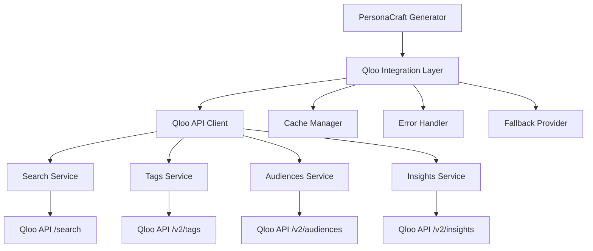
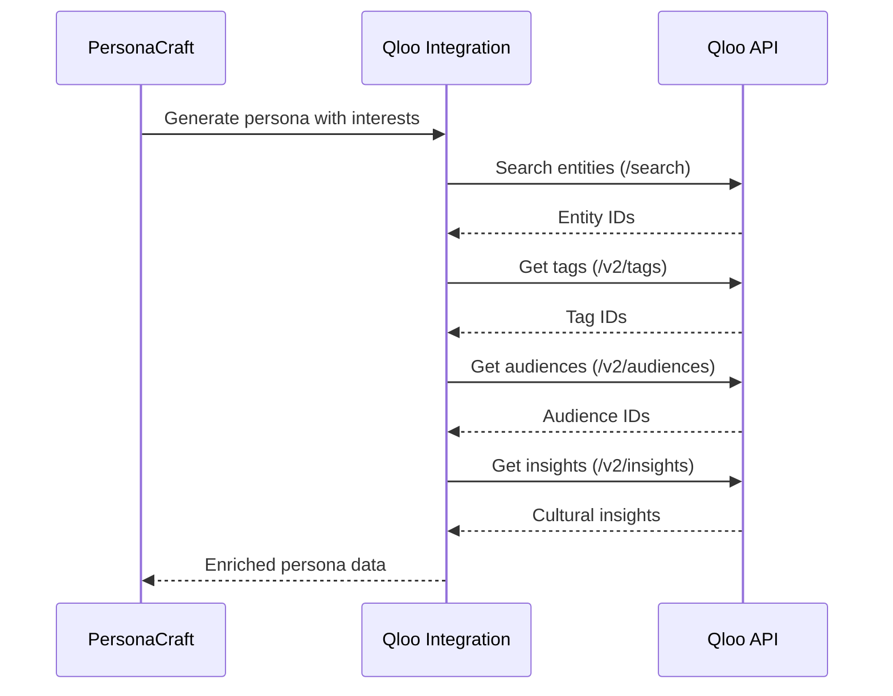

# Design Document - Refactorisation API Qloo

## Overview

Cette conception détaille la refactorisation complète de l'intégration API Qloo dans PersonaCraft pour se conformer aux spécifications officielles du hackathon Qloo. L'architecture proposée remplace l'implémentation actuelle par un système robuste qui utilise correctement les endpoints documentés, suit le flux de données recommandé, et exploite pleinement les capacités de Qloo Taste AI™.

La nouvelle architecture adopte une approche modulaire avec séparation claire des responsabilités, gestion d'erreurs robuste, et optimisations de performance pour une intégration fiable et maintenable.

## Architecture

### Architecture Globale



### Flux de Données Recommandé



## Components and Interfaces

### 1. Qloo API Client

**Responsabilité**: Gestion des appels HTTP vers l'API Qloo avec authentification et gestion d'erreurs.

```typescript
interface QlooApiClient {
  search(query: string, type: EntityType): Promise<SearchResult[]>
  getTags(filters?: TagFilters): Promise<Tag[]>
  getAudiences(filters?: AudienceFilters): Promise<Audience[]>
  getInsights(params: InsightsParams): Promise<InsightsResponse>
}

interface QlooConfig {
  baseUrl: 'https://hackathon.api.qloo.com'
  apiKey: string
  timeout: number
  retryAttempts: number
}
```

**Rationale**: Centralise tous les appels API avec une interface cohérente et type-safe. L'utilisation de l'URL de base officielle garantit la conformité.

### 2. Services Spécialisés

#### Search Service
```typescript
interface SearchService {
  searchEntities(query: string, type: EntityUrn): Promise<EntityResult[]>
  batchSearch(queries: SearchQuery[]): Promise<BatchSearchResult>
}

type EntityUrn = 
  | 'urn:entity:brand'
  | 'urn:entity:artist' 
  | 'urn:entity:movie'
  | 'urn:entity:tv_show'
  | 'urn:entity:book'
```

#### Tags Service
```typescript
interface TagsService {
  getTagsByCategory(category?: string): Promise<Tag[]>
  searchTags(query: string): Promise<Tag[]>
  validateTagIds(tagIds: string[]): Promise<ValidationResult>
}
```

#### Insights Service
```typescript
interface InsightsService {
  getInsights(params: InsightsParams): Promise<InsightsResponse>
  validateParams(params: InsightsParams): ValidationResult
}

interface InsightsParams {
  'filter.type': EntityUrn
  'signal.interests.entities'?: string[]
  'signal.interests.tags'?: string[]
  'signal.demographics.audiences'?: string[]
  'filter.tags'?: string[]
  'filter.entities'?: string[]
}
```

**Rationale**: Séparation des responsabilités par endpoint pour une meilleure maintenabilité et testabilité. Chaque service encapsule la logique spécifique à son domaine.

### 3. Cache Manager

```typescript
interface CacheManager {
  get<T>(key: string): Promise<T | null>
  set<T>(key: string, value: T, ttl: number): Promise<void>
  invalidate(pattern: string): Promise<void>
  getStats(): CacheStats
}

interface CacheConfig {
  defaultTtl: number
  maxSize: number
  strategy: 'lru' | 'fifo'
}
```

**Rationale**: Cache intelligent pour réduire les appels API répétés et respecter les limites de taux. TTL configurable selon les types de données.

### 4. Error Handler

```typescript
interface ErrorHandler {
  handleApiError(error: QlooApiError): HandledError
  shouldRetry(error: QlooApiError): boolean
  getFallbackData(context: ErrorContext): FallbackData
}

interface QlooApiError {
  status: number
  message: string
  code?: string
  details?: any
}
```

**Rationale**: Gestion centralisée des erreurs avec stratégies de retry et fallback appropriées selon le type d'erreur.

## Data Models

### Types Conformes Qloo

```typescript
// Entités Qloo
interface QlooEntity {
  id: string
  name: string
  type: EntityUrn
  metadata?: Record<string, any>
}

// Tags Qloo
interface QlooTag {
  id: string
  name: string
  category?: string
  weight?: number
}

// Audiences Qloo
interface QlooAudience {
  id: string
  name: string
  demographics?: Demographics
  size?: number
}

// Réponse Insights
interface QlooInsightsResponse {
  entities: QlooEntity[]
  tags: QlooTag[]
  audiences: QlooAudience[]
  confidence: number
  metadata: {
    requestId: string
    processingTime: number
    dataSource: string
  }
}
```

### Intégration PersonaCraft

```typescript
interface EnrichedPersonaData {
  culturalInsights: {
    music: QlooEntity[]
    movies: QlooEntity[]
    brands: QlooEntity[]
    books: QlooEntity[]
    tvShows: QlooEntity[]
  }
  demographics: QlooAudience[]
  interests: QlooTag[]
  confidence: number
  sources: {
    qloo: boolean
    fallback: boolean
    cached: boolean
  }
}
```

**Rationale**: Types strictement alignés sur les spécifications Qloo pour garantir la compatibilité. Structure enrichie pour PersonaCraft qui préserve la traçabilité des sources.

## Error Handling

### Stratégie de Gestion d'Erreurs

```typescript
enum QlooErrorType {
  AUTHENTICATION = 'auth_error',
  AUTHORIZATION = 'permission_error', 
  VALIDATION = 'validation_error',
  RATE_LIMIT = 'rate_limit_error',
  SERVER_ERROR = 'server_error',
  NETWORK_ERROR = 'network_error'
}

interface ErrorStrategy {
  [QlooErrorType.AUTHENTICATION]: () => AuthErrorResponse
  [QlooErrorType.AUTHORIZATION]: () => PermissionErrorResponse
  [QlooErrorType.VALIDATION]: (context: ValidationContext) => ValidationErrorResponse
  [QlooErrorType.RATE_LIMIT]: () => RateLimitResponse
  [QlooErrorType.SERVER_ERROR]: () => ServerErrorResponse
  [QlooErrorType.NETWORK_ERROR]: () => NetworkErrorResponse
}
```

### Fallback Intelligent

```typescript
interface FallbackProvider {
  getEntityFallback(type: EntityUrn, context: PersonaContext): QlooEntity[]
  getTagFallback(interests: string[]): QlooTag[]
  getAudienceFallback(demographics: Demographics): QlooAudience[]
}
```

**Rationale**: Système de fallback intelligent qui maintient la cohérence des données même en cas d'échec API. Stratégies différenciées selon le type d'erreur.

### Retry Logic

```typescript
interface RetryConfig {
  maxAttempts: 3
  baseDelay: 1000
  maxDelay: 10000
  backoffMultiplier: 2
  retryableErrors: QlooErrorType[]
}
```

**Rationale**: Backoff exponentiel pour gérer les limites de taux et les erreurs temporaires sans surcharger l'API.

## Testing Strategy

### Tests Unitaires

1. **API Client Tests**
   - Tests pour chaque endpoint avec mocks
   - Validation des paramètres et headers
   - Gestion des codes d'erreur HTTP

2. **Service Tests**
   - Tests de logique métier pour chaque service
   - Validation des transformations de données
   - Tests de cache et invalidation

3. **Integration Tests**
   - Tests du flux complet de données
   - Tests avec données réelles (environnement de test)
   - Validation de la conformité Qloo

### Tests d'Erreurs

```typescript
describe('Qloo Error Handling', () => {
  test('handles 401 authentication errors')
  test('handles 403 permission errors') 
  test('handles validation errors with proper fallback')
  test('implements exponential backoff for rate limits')
  test('provides coherent fallback data')
})
```

### Tests de Performance

```typescript
describe('Qloo Performance', () => {
  test('caches repeated requests effectively')
  test('batches similar entity searches')
  test('respects rate limits')
  test('maintains acceptable response times')
})
```

**Rationale**: Stratégie de test complète couvrant tous les aspects critiques : conformité API, gestion d'erreurs, performance, et intégration PersonaCraft.

## Performance Optimizations

### Cache Strategy

```typescript
interface CacheStrategy {
  entities: { ttl: 3600000, key: 'entity:{type}:{query}' }
  tags: { ttl: 7200000, key: 'tags:{category}' }
  audiences: { ttl: 86400000, key: 'audiences:{filter}' }
  insights: { ttl: 1800000, key: 'insights:{hash}' }
}
```

### Batching Strategy

```typescript
interface BatchProcessor {
  batchEntitySearches(queries: SearchQuery[]): Promise<BatchResult>
  optimizeInsightRequests(requests: InsightsRequest[]): Promise<OptimizedResult>
}
```

### Rate Limiting

```typescript
interface RateLimiter {
  checkLimit(endpoint: string): Promise<boolean>
  waitForSlot(endpoint: string): Promise<void>
  updateLimits(headers: ResponseHeaders): void
}
```

**Rationale**: Optimisations multicouches pour minimiser les appels API, respecter les limites, et maintenir des performances élevées.

## Monitoring and Observability

### Métriques

```typescript
interface QlooMetrics {
  apiCalls: {
    total: number
    byEndpoint: Record<string, number>
    successRate: number
    averageResponseTime: number
  }
  cache: {
    hitRate: number
    missRate: number
    evictions: number
  }
  errors: {
    byType: Record<QlooErrorType, number>
    fallbackUsage: number
  }
}
```

### Logging

```typescript
interface QlooLogger {
  logApiCall(endpoint: string, params: any, response: any): void
  logError(error: QlooApiError, context: any): void
  logCacheOperation(operation: string, key: string, result: any): void
  logFallbackUsage(reason: string, context: any): void
}
```

**Rationale**: Observabilité complète pour maintenir et optimiser l'intégration en production. Métriques essentielles pour le monitoring et le debugging.

## Security Considerations

### API Key Management

```typescript
interface SecurityConfig {
  apiKeyRotation: boolean
  keyValidation: boolean
  requestSigning: boolean
  rateLimitProtection: boolean
}
```

### Data Privacy

```typescript
interface PrivacyConfig {
  dataRetention: number
  piiFiltering: boolean
  auditLogging: boolean
  encryptionAtRest: boolean
}
```

**Rationale**: Sécurité robuste pour protéger les clés API et respecter les exigences de confidentialité des données utilisateur.

## Migration Strategy

### Phase 1: Infrastructure
- Mise en place du nouveau client API
- Configuration des services de base
- Tests unitaires et d'intégration

### Phase 2: Integration
- Remplacement progressif de l'ancienne intégration
- Tests avec données réelles
- Validation de la conformité

### Phase 3: Optimization
- Mise en place du cache et des optimisations
- Monitoring et métriques
- Documentation finale

**Rationale**: Migration progressive pour minimiser les risques et permettre une validation continue de la conformité.