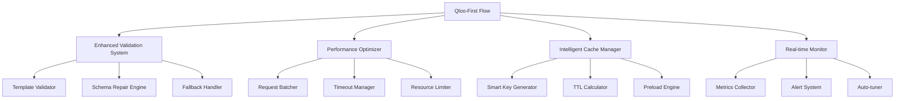
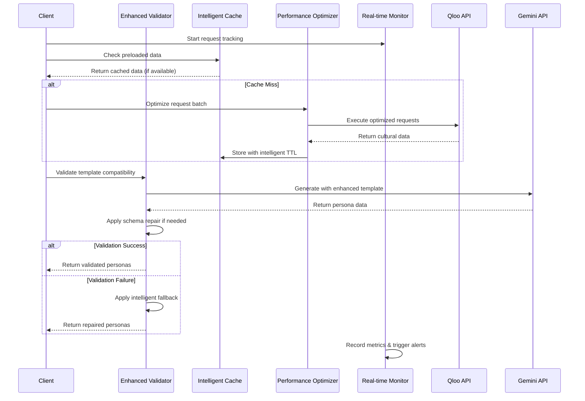

# Design Document

## Overview

Ce document décrit la conception d'un système d'optimisation des performances pour le flow Qloo-first de génération de personas. Le système vise à résoudre trois problèmes critiques : les échecs de validation (score 0), les temps de traitement excessifs (104s vs 30s max), et le faible taux de cache (28% vs 70% cible).

L'approche consiste à créer un système intégré d'optimisation qui combine validation intelligente, cache adaptatif, monitoring en temps réel, et mécanismes de récupération automatique.

## Architecture

### Composants Principaux



### Flux de Données Optimisé



## Components and Interfaces

### 1. Enhanced Validation System

#### QlooFirstValidator
```typescript
interface QlooFirstValidator {
  validateTemplate(template: string, culturalData: CulturalConstraints): ValidationResult;
  repairPersonaData(rawData: string, expectedSchema: Schema): PersonaData[];
  applyIntelligentFallback(failedData: any, context: ValidationContext): PersonaData[];
  getValidationMetrics(): ValidationMetrics;
}

interface ValidationResult {
  isValid: boolean;
  score: number;
  errors: ValidationError[];
  warnings: ValidationWarning[];
  repairSuggestions: RepairSuggestion[];
}

interface ValidationContext {
  originalBrief: string;
  culturalConstraints: CulturalConstraints;
  targetSchema: 'simple' | 'standard' | 'b2b';
  personaCount: number;
}
```

#### Schema Repair Engine
```typescript
interface SchemaRepairEngine {
  detectIssues(rawData: string): RepairIssue[];
  repairJsonStructure(malformedJson: string): string;
  fillMissingFields(persona: Partial<Persona>, context: ValidationContext): Persona;
  normalizeFieldTypes(persona: any): Persona;
}

interface RepairIssue {
  type: 'missing_field' | 'invalid_type' | 'malformed_json' | 'constraint_violation';
  field?: string;
  expected: any;
  actual: any;
  severity: 'error' | 'warning';
  autoFixable: boolean;
}
```

### 2. Performance Optimizer

#### RequestOptimizer
```typescript
interface RequestOptimizer {
  optimizeBatch(requests: QlooRequest[]): OptimizedBatch;
  calculateOptimalTimeout(entityType: string, complexity: number): number;
  manageResourceLimits(currentLoad: SystemLoad): ResourceLimits;
  predictResponseTime(request: QlooRequest): number;
}

interface OptimizedBatch {
  highPriority: QlooRequest[];
  mediumPriority: QlooRequest[];
  lowPriority: QlooRequest[];
  estimatedTotalTime: number;
  concurrencyLimit: number;
}

interface SystemLoad {
  memoryUsage: number;
  cpuUsage: number;
  activeRequests: number;
  queueLength: number;
}
```

#### Timeout Manager
```typescript
interface TimeoutManager {
  setDynamicTimeout(request: QlooRequest): number;
  handleTimeout(request: QlooRequest): Promise<any>;
  getTimeoutStatistics(): TimeoutStats;
}

interface TimeoutStats {
  averageResponseTime: number;
  timeoutRate: number;
  optimalTimeouts: Record<string, number>;
}
```

### 3. Intelligent Cache Manager

#### SmartCacheManager
```typescript
interface SmartCacheManager {
  generateOptimalKey(params: CacheKeyParams): string;
  calculateIntelligentTTL(data: any, context: CacheContext): number;
  preloadPredictiveData(patterns: UsagePattern[]): Promise<void>;
  evictIntelligently(): void;
  getOptimizationSuggestions(): CacheOptimization[];
}

interface CacheKeyParams {
  entityType: string;
  demographics: Demographics;
  interests: string[];
  values: string[];
  contextHash: string;
}

interface CacheContext {
  dataQuality: number;
  accessFrequency: number;
  dataVolatility: number;
  userContext: UserContext;
}

interface UsagePattern {
  entityType: string;
  frequency: number;
  timeOfDay: number[];
  userSegment: string;
  predictedDemand: number;
}
```

#### Preload Engine
```typescript
interface PreloadEngine {
  analyzeUsagePatterns(): UsagePattern[];
  predictNextRequests(currentRequest: QlooRequest): QlooRequest[];
  warmCacheIntelligently(patterns: UsagePattern[]): Promise<void>;
  schedulePreloading(schedule: PreloadSchedule): void;
}

interface PreloadSchedule {
  patterns: UsagePattern[];
  timing: 'immediate' | 'background' | 'scheduled';
  priority: number;
  maxResources: ResourceLimits;
}
```

### 4. Real-time Monitor

#### PerformanceMonitor
```typescript
interface PerformanceMonitor {
  trackRequest(request: QlooRequest): RequestTracker;
  recordMetrics(metrics: PerformanceMetrics): void;
  triggerAlerts(thresholds: AlertThresholds): void;
  generateOptimizationSuggestions(): OptimizationSuggestion[];
  getRealtimeDashboard(): DashboardData;
}

interface RequestTracker {
  startTime: number;
  phases: Record<string, number>;
  markPhase(phase: string): void;
  complete(result: any): void;
  fail(error: Error): void;
}

interface PerformanceMetrics {
  responseTime: number;
  cacheHitRate: number;
  validationSuccessRate: number;
  resourceUsage: SystemLoad;
  errorRate: number;
}
```

#### Alert System
```typescript
interface AlertSystem {
  defineThresholds(thresholds: AlertThresholds): void;
  checkThresholds(metrics: PerformanceMetrics): Alert[];
  sendAlert(alert: Alert): void;
  getAlertHistory(): Alert[];
}

interface Alert {
  type: 'performance' | 'validation' | 'cache' | 'resource';
  severity: 'low' | 'medium' | 'high' | 'critical';
  message: string;
  metrics: any;
  timestamp: number;
  autoActions: AutoAction[];
}

interface AutoAction {
  type: 'cache_warm' | 'timeout_adjust' | 'resource_limit' | 'fallback_enable';
  parameters: any;
  executed: boolean;
}
```

## Data Models

### Enhanced Validation Models
```typescript
interface ValidationMetrics {
  successRate: number;
  averageScore: number;
  commonErrors: Record<string, number>;
  repairSuccessRate: number;
  fallbackUsageRate: number;
}

interface ValidationError {
  code: string;
  message: string;
  field?: string;
  severity: 'error' | 'warning';
  autoFixable: boolean;
  suggestedFix?: string;
}
```

### Performance Models
```typescript
interface PerformanceProfile {
  entityType: string;
  averageResponseTime: number;
  optimalTimeout: number;
  cacheHitRate: number;
  errorRate: number;
  resourceUsage: ResourceUsage;
}

interface ResourceUsage {
  memory: number;
  cpu: number;
  networkBandwidth: number;
  concurrentRequests: number;
}
```

### Cache Models
```typescript
interface CacheEntry {
  key: string;
  data: any;
  metadata: CacheMetadata;
  accessPattern: AccessPattern;
}

interface CacheMetadata {
  createdAt: number;
  expiresAt: number;
  accessCount: number;
  lastAccessed: number;
  dataQuality: number;
  size: number;
}

interface AccessPattern {
  frequency: number;
  timeDistribution: number[];
  userSegments: string[];
  contextSimilarity: number;
}
```

## Error Handling

### Validation Error Recovery
```typescript
class ValidationErrorRecovery {
  async handleValidationFailure(
    error: ValidationError,
    context: ValidationContext
  ): Promise<RecoveryResult> {
    switch (error.code) {
      case 'SCHEMA_MISMATCH':
        return this.repairSchemaIssues(error, context);
      case 'MISSING_REQUIRED_FIELDS':
        return this.fillMissingFields(error, context);
      case 'INVALID_JSON_FORMAT':
        return this.repairJsonStructure(error, context);
      case 'CONSTRAINT_VIOLATION':
        return this.adjustConstraints(error, context);
      default:
        return this.applyGenericFallback(error, context);
    }
  }
}
```

### Performance Error Handling
```typescript
class PerformanceErrorHandler {
  async handleTimeoutError(request: QlooRequest): Promise<any> {
    // Implement progressive timeout strategy
    const newTimeout = this.calculateProgressiveTimeout(request);
    return this.retryWithTimeout(request, newTimeout);
  }

  async handleResourceExhaustion(load: SystemLoad): Promise<void> {
    // Implement resource management strategy
    await this.reduceSystemLoad(load);
    this.adjustConcurrencyLimits(load);
  }
}
```

### Cache Error Recovery
```typescript
class CacheErrorRecovery {
  async handleCacheMiss(key: string, context: CacheContext): Promise<any> {
    // Implement intelligent cache warming
    const relatedKeys = this.findRelatedKeys(key, context);
    await this.preloadRelatedData(relatedKeys);
    
    // Return fallback data while warming cache
    return this.getFallbackData(key, context);
  }
}
```

## Testing Strategy

### Unit Testing
- **Validation Components**: Test schema repair, fallback mechanisms, error handling
- **Cache Components**: Test key generation, TTL calculation, eviction strategies
- **Performance Components**: Test timeout management, resource limiting, batch optimization
- **Monitoring Components**: Test metrics collection, alert triggering, dashboard data

### Integration Testing
- **End-to-End Flow**: Test complete Qloo-first generation with optimizations
- **Performance Benchmarks**: Measure improvements in response time, cache hit rate, validation success
- **Error Scenarios**: Test recovery mechanisms under various failure conditions
- **Load Testing**: Verify system behavior under high concurrent load

### Performance Testing
```typescript
interface PerformanceTestSuite {
  testValidationSpeed(): Promise<ValidationPerformanceResult>;
  testCacheEfficiency(): Promise<CachePerformanceResult>;
  testResourceUsage(): Promise<ResourceUsageResult>;
  testConcurrentLoad(): Promise<ConcurrencyResult>;
}

interface ValidationPerformanceResult {
  averageValidationTime: number;
  successRate: number;
  repairEffectiveness: number;
  fallbackUsage: number;
}
```

### Monitoring and Metrics
- **Real-time Dashboards**: Performance metrics, cache statistics, validation rates
- **Alert Systems**: Automated alerts for performance degradation, validation failures
- **Historical Analysis**: Trend analysis for optimization opportunities
- **A/B Testing**: Compare optimized vs non-optimized performance

Cette conception fournit une base solide pour résoudre les problèmes de performance identifiés tout en maintenant la robustesse et la fiabilité du système.