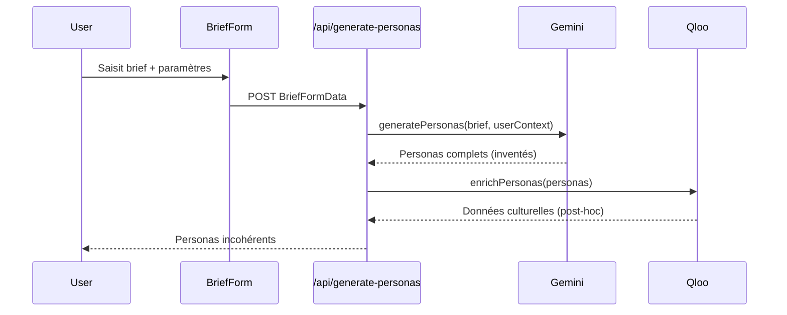
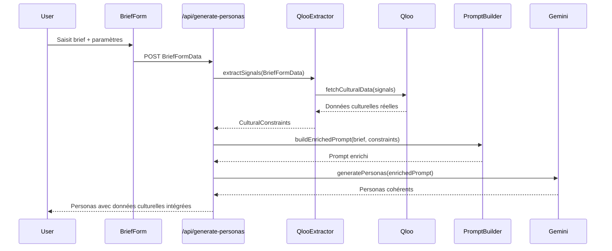

# Design Document

## Overview

Cette fonctionnalité implémente une inversion du flux logique de génération de personas, passant d'un modèle "Gemini first, Qloo second" à "Qloo first, Gemini second". Le nouveau flux utilise les données structurées du BriefForm pour d'abord extraire des signaux culturels concrets via l'API Qloo, puis utilise ces données comme contraintes pour guider la génération Gemini. Cette approche garantit une cohérence parfaite entre les spécifications utilisateur et les données culturelles réelles.

## Architecture

### Flux Actuel (Problématique)


### Nouveau Flux (Solution)


## Components and Interfaces

### 1. QlooSignalExtractor

Service responsable de l'extraction des signaux démographiques et culturels à partir du BriefFormData.

```typescript
interface QlooSignals {
  demographics: {
    ageRange: { min: number; max: number };
    location: string;
    occupation?: string; // extrait du brief si possible
  };
  interests: string[]; // PREDEFINED_INTERESTS + custom
  values: string[]; // PREDEFINED_VALUES + custom
  culturalContext: {
    language: 'fr' | 'en';
    personaCount: number;
  };
}

interface CulturalConstraints {
  music: string[];
  brands: string[];
  restaurants: string[];
  movies: string[];
  tv: string[];
  books: string[];
  travel: string[];
  fashion: string[];
  beauty: string[];
  food: string[];
  socialMedia: string[];
}

class QlooSignalExtractor {
  extractSignals(briefFormData: BriefFormData): QlooSignals;
  fetchCulturalData(signals: QlooSignals): Promise<CulturalConstraints>;
  private mapInterestsToQlooCategories(interests: string[]): string[];
  private mapValuesToQlooSignals(values: string[]): Record<string, string>;
}
```

### 2. EnrichedPromptBuilder

Service responsable de la construction de prompts Gemini enrichis avec les contraintes culturelles Qloo.

```typescript
interface EnrichedPromptContext {
  originalBrief: string;
  culturalConstraints: CulturalConstraints;
  userSignals: QlooSignals;
  templateVariables: Record<string, any>;
}

class EnrichedPromptBuilder {
  buildPrompt(context: EnrichedPromptContext): Promise<string>;
  private injectCulturalConstraints(basePrompt: string, constraints: CulturalConstraints): string;
  private formatConstraintsForGemini(constraints: CulturalConstraints): string;
  private validatePromptLength(prompt: string): boolean;
}
```

### 3. QlooFirstPersonaGenerator

Service principal orchestrant le nouveau flux de génération.

```typescript
interface GenerationResult {
  personas: Partial<Persona>[];
  metadata: {
    source: 'qloo-first' | 'fallback-legacy';
    qlooDataUsed: boolean;
    culturalConstraintsApplied: string[];
    processingTime: number;
  };
}

class QlooFirstPersonaGenerator {
  async generatePersonas(briefFormData: BriefFormData): Promise<GenerationResult>;
  private async extractAndFetchCulturalData(briefFormData: BriefFormData): Promise<CulturalConstraints>;
  private async generateWithConstraints(brief: string, constraints: CulturalConstraints, signals: QlooSignals): Promise<Partial<Persona>[]>;
  private async fallbackToLegacyFlow(briefFormData: BriefFormData): Promise<GenerationResult>;
}
```

### 4. Feature Flag Integration

```typescript
interface FeatureFlags {
  qlooFirstGeneration: boolean;
  qlooFirstFallbackEnabled: boolean;
  qlooFirstDebugMode: boolean;
}

class FeatureFlagService {
  isQlooFirstEnabled(): boolean;
  shouldFallbackOnError(): boolean;
  isDebugModeEnabled(): boolean;
}
```

## Data Models

### BriefFormData (Existing)
```typescript
interface BriefFormData {
  brief: string;
  ageRange: { min: number; max: number };
  location: string;
  language: 'fr' | 'en';
  personaCount: number;
  interests: string[]; // Mix of PREDEFINED_INTERESTS and custom
  values: string[]; // Mix of PREDEFINED_VALUES and custom
}
```

### QlooApiRequest (Enhanced)
```typescript
interface QlooApiRequest {
  entityType: string;
  signals: {
    'signal.demographics.audiences': string;
    'signal.demographics.location': string;
    [key: string]: string; // Additional signals from interests/values
  };
  take: number;
  cacheKey: string;
}
```

### EnrichedPersona (Output)
```typescript
interface EnrichedPersona extends Partial<Persona> {
  culturalData: CulturalData; // Directly from Qloo, not post-processed
  metadata: {
    qlooConstraintsUsed: string[];
    generationMethod: 'qloo-first' | 'legacy-fallback';
    culturalDataSource: 'qloo' | 'fallback';
  };
}
```

## Error Handling

### Error Types
```typescript
enum QlooFirstError {
  QLOO_API_UNAVAILABLE = 'QLOO_API_UNAVAILABLE',
  SIGNAL_EXTRACTION_FAILED = 'SIGNAL_EXTRACTION_FAILED',
  CULTURAL_DATA_INSUFFICIENT = 'CULTURAL_DATA_INSUFFICIENT',
  PROMPT_BUILDING_FAILED = 'PROMPT_BUILDING_FAILED',
  GEMINI_GENERATION_FAILED = 'GEMINI_GENERATION_FAILED'
}

interface ErrorHandlingStrategy {
  error: QlooFirstError;
  fallbackAction: 'retry' | 'legacy-flow' | 'fail';
  maxRetries: number;
}
```

### Fallback Strategy
1. **Qloo API Error**: Fallback vers l'ancien flux avec indicateur de source
2. **Signal Extraction Error**: Utiliser des signaux par défaut basés sur le brief
3. **Prompt Building Error**: Utiliser le prompt original sans enrichissement
4. **Gemini Error**: Retourner une erreur standard (comportement existant)

## Testing Strategy

### Unit Tests
- `QlooSignalExtractor`: Test d'extraction des signaux depuis BriefFormData
- `EnrichedPromptBuilder`: Test de construction de prompts avec contraintes
- `QlooFirstPersonaGenerator`: Test du flux complet avec mocks
- Mappers Qloo: Test des mappings interests/values vers signaux Qloo

### Integration Tests
- Test du flux complet avec vraies APIs (environnement de test)
- Test des fallbacks en cas d'erreur Qloo
- Test de cohérence entre données BriefForm et personas générés
- Test de performance avec différents volumes de données

### End-to-End Tests
- Test du formulaire BriefForm → API → Personas cohérents
- Test de la feature flag activation/désactivation
- Test des différentes combinaisons d'intérêts/valeurs
- Test multilingue (fr/en)

## Performance Considerations

### Optimizations
1. **Batch Qloo Requests**: Grouper les appels par type d'entité
2. **Parallel Processing**: Exécuter les appels Qloo en parallèle
3. **Smart Caching**: Cache basé sur les signaux extraits
4. **Request Deduplication**: Éviter les appels redondants pour les mêmes signaux

### Monitoring
```typescript
interface PerformanceMetrics {
  qlooExtractionTime: number;
  qlooApiCallsCount: number;
  promptBuildingTime: number;
  geminiGenerationTime: number;
  totalProcessingTime: number;
  cacheHitRate: number;
}
```

## Migration Strategy

### Phase 1: Implementation
- Créer les nouveaux services sans impacter l'existant
- Implémenter la feature flag (désactivée par défaut)
- Tests complets en environnement de développement

### Phase 2: Gradual Rollout
- Activer la feature flag pour un pourcentage d'utilisateurs
- Monitoring des performances et de la qualité
- Collecte de feedback utilisateur

### Phase 3: Full Migration
- Activation complète de la feature flag
- Dépréciation progressive de l'ancien flux
- Nettoyage du code legacy

## Configuration

### Environment Variables
```bash
# Feature Flags
QLOO_FIRST_GENERATION_ENABLED=true
QLOO_FIRST_FALLBACK_ENABLED=true
QLOO_FIRST_DEBUG_MODE=false

# Performance Tuning
QLOO_FIRST_BATCH_SIZE=5
QLOO_FIRST_PARALLEL_REQUESTS=3
QLOO_FIRST_CACHE_TTL=3600
```

### Runtime Configuration
```typescript
interface QlooFirstConfig {
  enabled: boolean;
  fallbackEnabled: boolean;
  debugMode: boolean;
  batchSize: number;
  maxParallelRequests: number;
  cacheTTL: number;
  supportedLanguages: ('fr' | 'en')[];
}
```