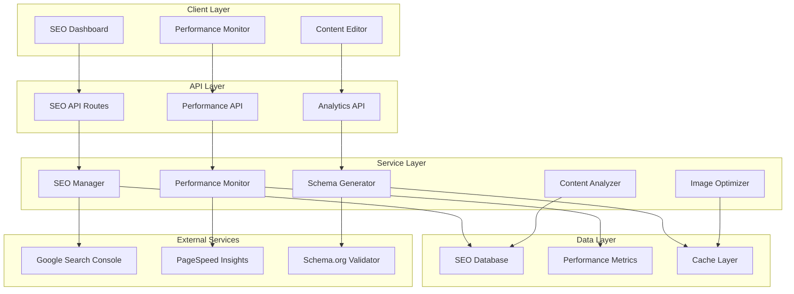

# Design Document

## Overview

The SEO, Performance, and Optimization system is a comprehensive solution that enhances the PersonaCraft application with advanced SEO capabilities, performance monitoring, and automated optimization features. The system integrates seamlessly with the existing Next.js 15 architecture, leveraging modern web standards and best practices to improve search engine visibility, user experience, and site performance.

The system consists of multiple interconnected modules: SEO Management, Performance Monitoring, Structured Data Generation, Content Optimization, and Analytics Dashboard. Each module is designed to work independently while contributing to the overall optimization goals.

## Architecture

### High-Level Architecture



### Core Components

1. **SEO Management System**: Handles meta tags, structured data, and SEO optimization
2. **Performance Monitoring**: Tracks Core Web Vitals and performance metrics
3. **Content Optimization**: Analyzes and optimizes content for SEO
4. **Image Optimization**: Automatic image compression and format conversion
5. **Analytics Dashboard**: Comprehensive reporting and insights

## Components and Interfaces

### SEO Management System

#### SEOManager Service
```typescript
interface SEOManager {
  generateMetaTags(pageData: PageData): MetaTags;
  updateSEOData(pageId: string, seoData: SEOData): Promise<void>;
  generateSitemap(): Promise<string>;
  updateRobotsTxt(): Promise<void>;
  validateSEO(pageId: string): Promise<SEOValidationResult>;
}

interface MetaTags {
  title: string;
  description: string;
  keywords: string[];
  openGraph: OpenGraphData;
  twitterCard: TwitterCardData;
  canonical: string;
  robots: string;
}

interface SEOData {
  title?: string;
  description?: string;
  keywords?: string[];
  customMeta?: Record<string, string>;
  structuredData?: StructuredData[];
}
```

#### Dynamic Meta Component
```typescript
interface DynamicMetaProps {
  pageType: 'home' | 'persona' | 'dashboard' | 'blog';
  pageData?: any;
  customSEO?: SEOData;
}

const DynamicMeta: React.FC<DynamicMetaProps> = ({ pageType, pageData, customSEO }) => {
  // Generates appropriate meta tags based on page type and data
};
```

### Performance Monitoring System

#### PerformanceMonitor Service
```typescript
interface PerformanceMonitor {
  trackCoreWebVitals(): void;
  measurePageLoad(pageId: string): Promise<PerformanceMetrics>;
  analyzeBundle(): Promise<BundleAnalysis>;
  optimizeImages(images: ImageData[]): Promise<OptimizedImage[]>;
  generatePerformanceReport(): Promise<PerformanceReport>;
}

interface PerformanceMetrics {
  lcp: number; // Largest Contentful Paint
  fid: number; // First Input Delay
  cls: number; // Cumulative Layout Shift
  ttfb: number; // Time to First Byte
  fcp: number; // First Contentful Paint
  loadTime: number;
  bundleSize: number;
}

interface CoreWebVitals {
  lcp: { value: number; rating: 'good' | 'needs-improvement' | 'poor' };
  fid: { value: number; rating: 'good' | 'needs-improvement' | 'poor' };
  cls: { value: number; rating: 'good' | 'needs-improvement' | 'poor' };
}
```

#### Performance Dashboard Component
```typescript
interface PerformanceDashboardProps {
  timeRange: '24h' | '7d' | '30d';
  pageFilter?: string;
}

const PerformanceDashboard: React.FC<PerformanceDashboardProps> = ({ timeRange, pageFilter }) => {
  // Displays performance metrics, trends, and optimization suggestions
};
```

### Structured Data System

#### SchemaGenerator Service
```typescript
interface SchemaGenerator {
  generatePersonaSchema(persona: PersonaData): StructuredData;
  generateOrganizationSchema(): StructuredData;
  generateArticleSchema(article: ArticleData): StructuredData;
  generateBreadcrumbSchema(breadcrumbs: BreadcrumbItem[]): StructuredData;
  validateSchema(schema: StructuredData): Promise<ValidationResult>;
}

interface StructuredData {
  '@context': string;
  '@type': string;
  [key: string]: any;
}

interface PersonaSchema extends StructuredData {
  '@type': 'Person';
  name: string;
  description: string;
  knowsAbout: string[];
  memberOf?: Organization;
}
```

### Content Optimization System

#### ContentAnalyzer Service
```typescript
interface ContentAnalyzer {
  analyzeSEO(content: string, targetKeywords: string[]): SEOAnalysis;
  checkReadability(content: string): ReadabilityScore;
  validateHeadingStructure(content: string): HeadingValidation;
  suggestOptimizations(analysis: SEOAnalysis): OptimizationSuggestion[];
  extractKeywords(content: string): KeywordAnalysis;
}

interface SEOAnalysis {
  keywordDensity: Record<string, number>;
  headingStructure: HeadingStructure;
  readabilityScore: number;
  contentLength: number;
  internalLinks: number;
  externalLinks: number;
  imageAltTags: number;
  metaDescription: string;
}

interface OptimizationSuggestion {
  type: 'keyword' | 'heading' | 'content' | 'meta' | 'image';
  priority: 'high' | 'medium' | 'low';
  message: string;
  suggestion: string;
}
```

### Image Optimization System

#### ImageOptimizer Service
```typescript
interface ImageOptimizer {
  optimizeImage(image: ImageInput): Promise<OptimizedImage>;
  generateResponsiveImages(image: ImageInput): Promise<ResponsiveImageSet>;
  convertToWebP(image: ImageInput): Promise<WebPImage>;
  compressImage(image: ImageInput, quality: number): Promise<CompressedImage>;
  generatePlaceholder(image: ImageInput): Promise<PlaceholderImage>;
}

interface OptimizedImage {
  original: ImageData;
  webp: ImageData;
  avif?: ImageData;
  placeholder: string; // Base64 blur placeholder
  sizes: ResponsiveSize[];
}

interface ResponsiveSize {
  width: number;
  height: number;
  url: string;
  format: 'webp' | 'avif' | 'jpeg' | 'png';
}
```

## Data Models

### SEO Database Schema

```typescript
// Prisma schema additions
model SEOData {
  id          String   @id @default(cuid())
  pageId      String   @unique
  title       String?
  description String?
  keywords    String[] // Array of keywords
  customMeta  Json?    // Custom meta tags
  structuredData Json[] // Array of structured data objects
  canonical   String?
  robots      String?  @default("index,follow")
  createdAt   DateTime @default(now())
  updatedAt   DateTime @updatedAt
  
  @@map("seo_data")
}

model PerformanceMetric {
  id         String   @id @default(cuid())
  pageId     String
  timestamp  DateTime @default(now())
  lcp        Float?   // Largest Contentful Paint
  fid        Float?   // First Input Delay
  cls        Float?   // Cumulative Layout Shift
  ttfb       Float?   // Time to First Byte
  fcp        Float?   // First Contentful Paint
  loadTime   Float
  bundleSize Int?
  userAgent  String?
  
  @@map("performance_metrics")
  @@index([pageId, timestamp])
}

model SEOAudit {
  id          String   @id @default(cuid())
  pageId      String
  auditDate   DateTime @default(now())
  score       Int      // SEO score out of 100
  issues      Json[]   // Array of SEO issues
  suggestions Json[]   // Array of optimization suggestions
  status      String   @default("pending") // pending, completed, failed
  
  @@map("seo_audits")
  @@index([pageId, auditDate])
}
```

### Configuration Models

```typescript
interface SEOConfig {
  siteName: string;
  siteUrl: string;
  defaultTitle: string;
  defaultDescription: string;
  defaultKeywords: string[];
  socialMedia: {
    twitter?: string;
    facebook?: string;
    linkedin?: string;
  };
  organization: {
    name: string;
    logo: string;
    contactPoint: ContactPoint[];
  };
  localBusiness?: LocalBusinessData;
}

interface PerformanceConfig {
  thresholds: {
    lcp: number; // 2.5s
    fid: number; // 100ms
    cls: number; // 0.1
  };
  monitoring: {
    enabled: boolean;
    sampleRate: number; // 0.1 = 10%
    reportingInterval: number; // minutes
  };
  optimization: {
    imageQuality: number; // 80
    enableWebP: boolean;
    enableAVIF: boolean;
    lazyLoading: boolean;
  };
}
```

## Error Handling

### SEO Error Handling

```typescript
class SEOError extends Error {
  constructor(
    message: string,
    public code: string,
    public pageId?: string,
    public details?: any
  ) {
    super(message);
    this.name = 'SEOError';
  }
}

// Error types
const SEO_ERROR_CODES = {
  INVALID_META_DATA: 'INVALID_META_DATA',
  SCHEMA_VALIDATION_FAILED: 'SCHEMA_VALIDATION_FAILED',
  SITEMAP_GENERATION_FAILED: 'SITEMAP_GENERATION_FAILED',
  ROBOTS_UPDATE_FAILED: 'ROBOTS_UPDATE_FAILED',
} as const;

// Error handling middleware
const handleSEOError = (error: SEOError) => {
  console.error(`SEO Error [${error.code}]:`, error.message);
  
  // Log to monitoring service
  if (error.pageId) {
    logSEOIssue(error.pageId, error.code, error.message);
  }
  
  // Return user-friendly error
  return {
    success: false,
    error: error.code,
    message: getErrorMessage(error.code),
  };
};
```

### Performance Error Handling

```typescript
class PerformanceError extends Error {
  constructor(
    message: string,
    public metric: string,
    public value: number,
    public threshold: number
  ) {
    super(message);
    this.name = 'PerformanceError';
  }
}

// Performance monitoring with error handling
const monitorPerformance = async (pageId: string) => {
  try {
    const metrics = await measurePagePerformance(pageId);
    
    // Check thresholds
    if (metrics.lcp > PERFORMANCE_THRESHOLDS.lcp) {
      throw new PerformanceError(
        'LCP threshold exceeded',
        'lcp',
        metrics.lcp,
        PERFORMANCE_THRESHOLDS.lcp
      );
    }
    
    return metrics;
  } catch (error) {
    if (error instanceof PerformanceError) {
      // Log performance issue
      await logPerformanceIssue(pageId, error.metric, error.value);
      
      // Trigger optimization suggestions
      await generateOptimizationSuggestions(pageId, error.metric);
    }
    
    throw error;
  }
};
```

## Testing Strategy

### Unit Testing

```typescript
// SEO Manager Tests
describe('SEOManager', () => {
  test('should generate valid meta tags for persona page', () => {
    const seoManager = new SEOManager();
    const personaData = { name: 'Tech Enthusiast', age: 28 };
    
    const metaTags = seoManager.generateMetaTags({
      type: 'persona',
      data: personaData
    });
    
    expect(metaTags.title).toContain('Tech Enthusiast');
    expect(metaTags.description).toBeDefined();
    expect(metaTags.openGraph.type).toBe('profile');
  });
  
  test('should validate SEO data correctly', async () => {
    const seoManager = new SEOManager();
    const invalidSEO = { title: '', description: 'a'.repeat(200) };
    
    const validation = await seoManager.validateSEO('page-1', invalidSEO);
    
    expect(validation.isValid).toBe(false);
    expect(validation.errors).toContain('Title is required');
    expect(validation.errors).toContain('Description too long');
  });
});

// Performance Monitor Tests
describe('PerformanceMonitor', () => {
  test('should track Core Web Vitals correctly', async () => {
    const monitor = new PerformanceMonitor();
    const metrics = await monitor.measurePageLoad('home');
    
    expect(metrics.lcp).toBeGreaterThan(0);
    expect(metrics.fid).toBeGreaterThanOrEqual(0);
    expect(metrics.cls).toBeGreaterThanOrEqual(0);
  });
  
  test('should generate optimization suggestions', async () => {
    const monitor = new PerformanceMonitor();
    const suggestions = await monitor.generateOptimizationSuggestions({
      lcp: 4000, // Poor LCP
      bundleSize: 2000000 // Large bundle
    });
    
    expect(suggestions).toContainEqual(
      expect.objectContaining({
        type: 'lcp',
        priority: 'high'
      })
    );
  });
});
```

### Integration Testing

```typescript
// SEO Integration Tests
describe('SEO Integration', () => {
  test('should generate and serve sitemap correctly', async () => {
    const response = await fetch('/sitemap.xml');
    const sitemap = await response.text();
    
    expect(response.status).toBe(200);
    expect(response.headers.get('content-type')).toBe('application/xml');
    expect(sitemap).toContain('<urlset');
    expect(sitemap).toContain('<url>');
  });
  
  test('should serve robots.txt with correct directives', async () => {
    const response = await fetch('/robots.txt');
    const robots = await response.text();
    
    expect(response.status).toBe(200);
    expect(robots).toContain('User-agent: *');
    expect(robots).toContain('Sitemap:');
  });
});

// Performance Integration Tests
describe('Performance Integration', () => {
  test('should collect real user metrics', async () => {
    // Simulate page load
    const startTime = performance.now();
    await loadPage('/dashboard');
    const loadTime = performance.now() - startTime;
    
    // Check if metrics were recorded
    const metrics = await getPerformanceMetrics('/dashboard');
    expect(metrics.length).toBeGreaterThan(0);
    expect(metrics[0].loadTime).toBeCloseTo(loadTime, -2);
  });
});
```

### End-to-End Testing

```typescript
// E2E SEO Tests
describe('SEO E2E', () => {
  test('should have proper meta tags on all pages', async () => {
    const pages = ['/', '/dashboard', '/dashboard/personas'];
    
    for (const page of pages) {
      await page.goto(page);
      
      // Check essential meta tags
      const title = await page.locator('title').textContent();
      const description = await page.locator('meta[name="description"]').getAttribute('content');
      
      expect(title).toBeTruthy();
      expect(description).toBeTruthy();
      expect(description.length).toBeLessThanOrEqual(160);
    }
  });
  
  test('should have valid structured data', async () => {
    await page.goto('/dashboard/personas/123');
    
    const structuredData = await page.locator('script[type="application/ld+json"]').textContent();
    const schema = JSON.parse(structuredData);
    
    expect(schema['@context']).toBe('https://schema.org');
    expect(schema['@type']).toBe('Person');
    expect(schema.name).toBeTruthy();
  });
});
```

## Implementation Phases

### Phase 1: Core SEO Infrastructure
- SEO database models and API routes
- Basic meta tag management
- Sitemap and robots.txt generation
- SEO validation system

### Phase 2: Performance Monitoring
- Core Web Vitals tracking
- Performance metrics collection
- Basic performance dashboard
- Image optimization system

### Phase 3: Advanced SEO Features
- Structured data generation
- Content optimization analyzer
- SEO audit system
- Advanced meta tag management

### Phase 4: Analytics and Reporting
- Comprehensive SEO dashboard
- Performance analytics
- Optimization recommendations
- Integration with external tools

### Phase 5: Automation and AI
- Automated SEO suggestions
- AI-powered content optimization
- Predictive performance monitoring
- Advanced analytics and insights